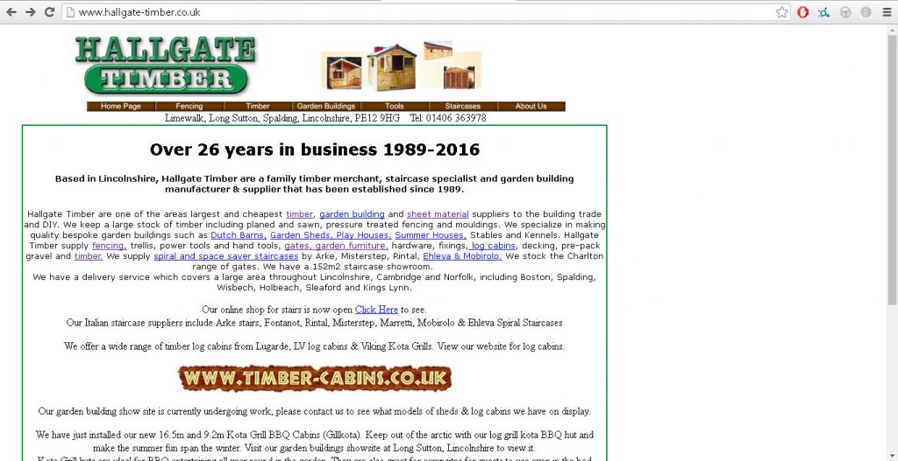
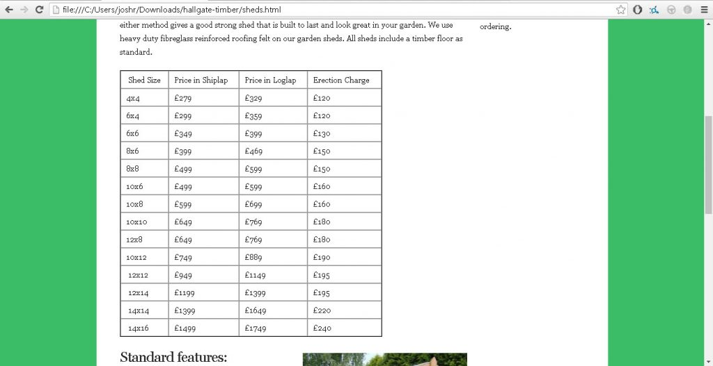

The Hallgate Timber website remodel is a project I am undertaking whilst working at the company, it is an in-house project which is allowing for constant feedback from the client. This project will be the first web-development project undertaken since my days at college (3 years ago), so this really should be a nice refresher/ learning experience.

The problem with the current website is that the website doesn't really follow any design schema. content is added without a lot of thought into design. whilst the website is functional and does serve its purpose to a point, there is a lot in which can be improved upon. Navigation on the website needs improvement, after creating a sitemap to see what is being hosted, put simply its confusing.

The first version of the new Hallgate Timber website adds a little more CSS style than before, but while keeping the functionality. One of my aims with the new site is to keep the sites depth to a minimum, so all of the websites content is easily found, something not so easily done on the previous website.
## HTML Tables

HTML tables are a common implementation on the old website, whilst they do serve their purpose, DIV tag tables are the preferred way to go nowadays.

**Before:**

**After:**

Whilst there isn't a dramatic different in the appearance of  over a div table, there are advantages to useing div tags, such as for users' with screen readers and other accessible browsers.
