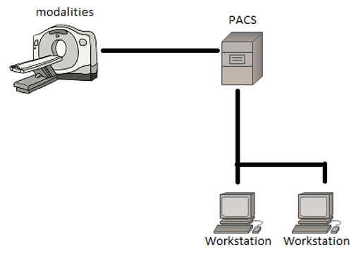
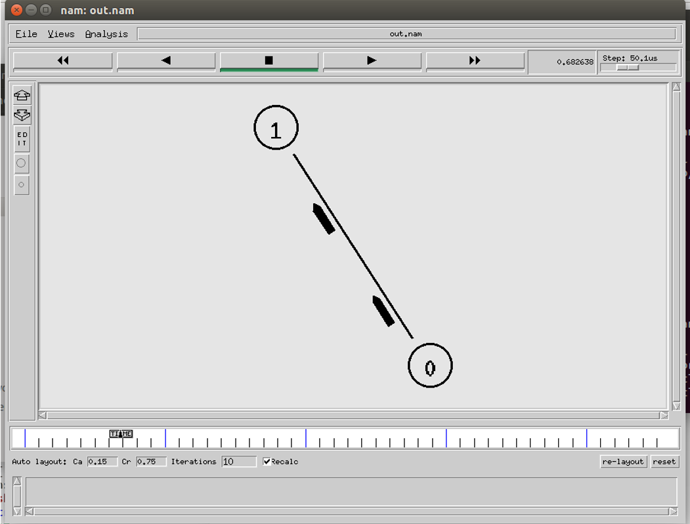
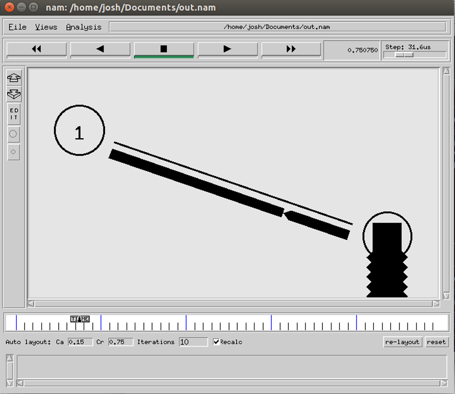
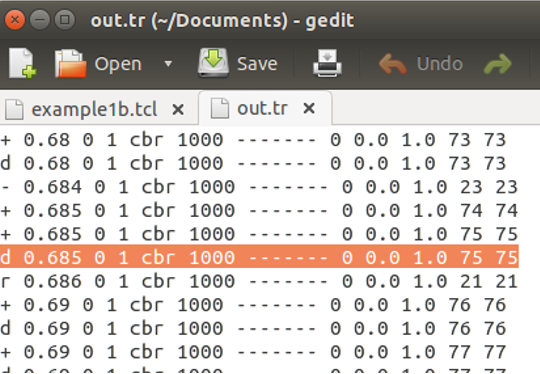
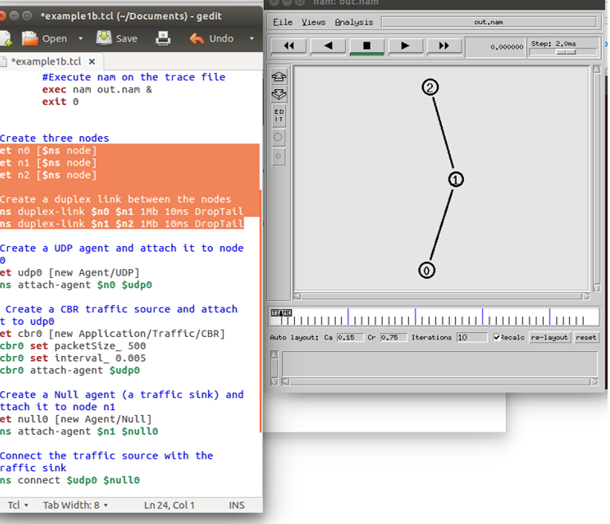
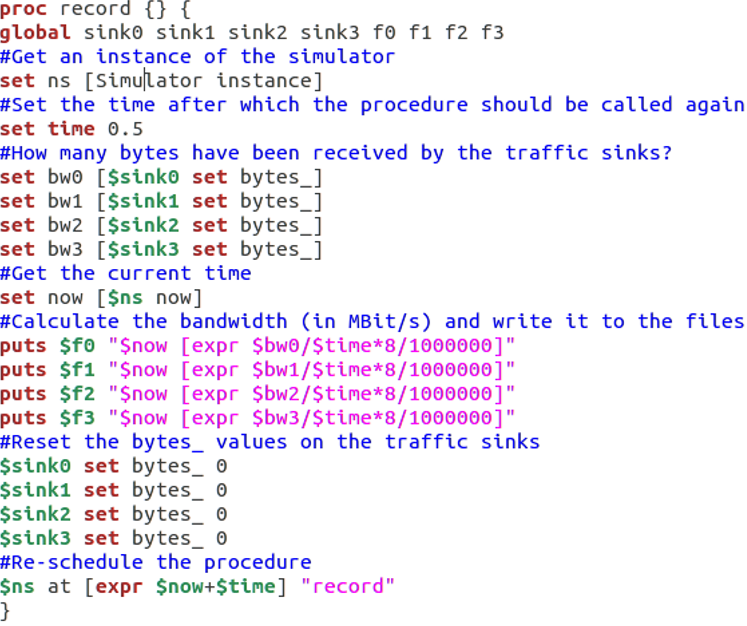
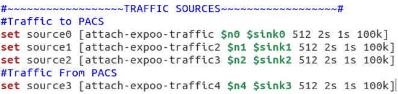
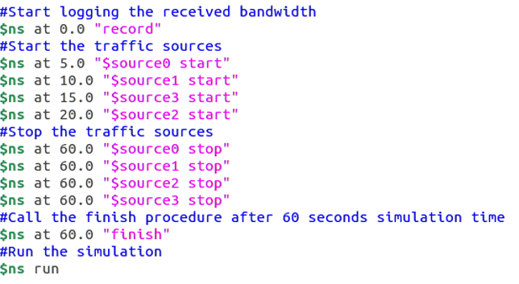

# Abstract

This project aims to address PACS network optimisation, as it is being increased in clinical use. More data is being transmitted across PACS network environments which may include patient records or patients’ medical images. Without optimisation the network may suffer performance issues.  This project plans to design and implement different topologies for the PACS network through simulations created using NS2. From the simulations produced within NS2, meaningful data is extracted from the trace files which is then statistically analysed though graphs and computation of the data to discover an optimised network. The resulting graphs depict packet loss through the testing of incrementing packet throughput rates. The outcome of this analysis is the Mesh topology, which proves to be the most resilient topology. However, further research into combining topologies should be conducted.
Please note this paper has been adjusted to accommodate itself as a blog entry.

# Acknowledgements

I would like to thank Dr Massoud Zolgharni for continuous support throughout the project, offering insightful guidance and feedback during each stage of the projects development.

# 1. Introduction

A Picture Archive Communication System (PACS) is a system which is comprised of medical imaging scanners (for example: CT or MRI scanner), storage mechanisms, information communication technologies, displays, and clinical workflow. A PACS network is the combination of PACS systems and nodes (computers) accessing storage of images. At any time, image files (often many) can be requested for viewing or being saved to storage mechanisms.



The concept of digital communication and digital radiology was introduced in the late 1970s and early 1980s. The beginning of PACS was attributed to development in the USA, where research was contributed by laboratories within universities and small companies in the private industry which had entered the field in 1982. In the early years of PACS evolution, research and development varied in the region which it was conducted; PACS research in North America was largely supported by government agencies and manufacturers (Huang, 2011). Research in Europe was supported through multi-national efforts since PACS components weren’t as accessible in Europe as N.A. and Asia so research emphasized on modelling and simulation. PACS research in Asia was led by Japan which treated it as a national project and resources were distributed to many manufacturers and university hospitals (Lemke, 2011).

A PACS network often has many workstations and modularity’s sending packets of information around in large numbers, being requested for viewing or being stored in PACS archives. (Santos, et al., 2015) Highlights this, although their research was oriented around DICOM metadata and there was a clear pattern of more images being produced year by year, all of which needs to be stored with redundancy in mind. With all this data being transmitted and received on the network, optimisation of how these nodes communicate would prove valuable for increased network performance.

Due to large image files being requested or being stored, network bandwidth can often be limited which causes slowness of the network, slowing workflow and potentially causing a lower quality of service for patients. As a PACS network can often consist of multiple storage mechanism’s which allow for data redundancy, bandwidth can be further limited.

This project not only aims to simulate a PACS network on the physical layer with clinical workflow in mind, but to also simulate different PACS networks’ comprised of different network topologies and scales of implementation (small scale to larger scale networks). By further simulating these different topologies and scales of implementation, it is hoped that data obtained can be used to additionally compare and contrast different network topologies across different network sizes. By doing this, it is hoped to achieve optimized network architecture for the PACS context.

This project will focus solely on the physical layer within the PACS, more specifically the way the nodes within the network communicate. It is expected that caveats can be distinguished within topology design through packets being ‘dropped’. Packets are ‘dropped’ in communication due to bandwidth of the connection being reached and so the connection cannot support anymore traffic being transmitted.

The PACS network requires optimisation due to its increase in clinical use. More data is being transmitted across PACS network environments, and this may be patient records or patients’ medical images, without optimisation the network may suffer performance issues.
# 2. Aims & Objectives

The goal of this project is to simulate different topologies in a PACS environment, retrieve meaningful data from the simulation, and then to use mathematical computation on the outputted data to compare and contrast the different topologies in order to discover an optimal network for PACS.
## 2.1 Aims


- Investigate common PACS network implantations to get an understanding of the different ways they are implemented.

- Design and implement different topologies for the PACS network environment.

- Retrieve meaningful data from the simulations developed.

- Statistically analyse the data retrieved from the simulations through graphs and computation of the data.

- From the statistical analysis, find an optimal network for PACS.


## 2.2 Objectives


- Design and develop a simple PACS network simulation.

- Design and develop simulations of different topologies.

- Apply different throughput allowances for each topology.

- Develop a way of retrieving meaningful data from simulations for analysis.

- Develop a way to compute data outputted and display results in a meaningful way.

- Compare and contrast implementation of different topologies from the results obtained from the simulations.

- Find an optimised PACS network.

- Summarise the results of the project.

- Perform a critical evaluation of the project.


# 3. Review of academic literature

The purpose of this project is to simulate and review different network topologies to define an optimised network for the PACS scenario. The scope of academic literature reviewed was in relation to the PACS network performance and measuring network performance using NS2. The literature reviewed is sorted by ascending publication year.

*Uw PACS Prototype Performance Measurements, Computer Model, and Simulation*

**(Panwar, et al., 1990) **Discussed their early efforts on simulating different PACS network architectures by creating models with NS2. From their studies they identified parameters in their model which would prove useful for this project such as;

- Image Acquisition Time: This is the time taken to receive and display an image packet. The time differs depending on the source (MRI, CT scanner) as the image may be larger or consist of many images.

- Local Disk Access Time: This is the read/write time for a packet on the local machine (workstation). Although the transfer rate was 0.25Mbyte/s, the rates have increased drastically in modern advances.

- Compression/ Decompression time: This is the time taken to compress or decompress image packets. This depends on the compression technique used, for example: JPG.

- Transmission Time: This is the time taken to transmit a packet between 2 nodes and is the result of a link between 2 nodes. This link could be a CAT5 cable or fibre optic cable.


Their research also discussed other parameters on their network such as traffic distributed from modularities on the network and the amount of images/packets in which these machines transmit. They were also able to discover bottlenecks with scaling up their own network (implementing a star topology), although the most considerable limitation discovered was the compression and decompression time of their hardware.  Transmission time was found to not be a bottleneck in their research. The parameters mentioned can still be applied to more modern networks, however, as technology has been advanced over time (more optimised compression techniques and hardware), the bottlenecks they have found may not be a bottleneck in more recent PACS networks.

*Performance Evaluation of a Picture Archiving and Communication Network Using Stochastic*

**(Martinez, et al., 1990) **Investigates star networks but also takes a range of workloads into consideration for measuring performance, more specifically implementing fibre-optic as the link between nodes, See Fig. 3. For example.


Components in their PACS network consisted of imaging equipment, viewing workstations, and a PACS archive system. The model simulated consisted of one star network, however, in reality a PACS network could consist of multiple star networks, for different departments.

The workflow used in simulations were a patient being admitted for a procedure session where images are generated from. The images taken during that session are stored locally on the imaging equipment. Once the procedures are complete, there is then a request for the images to be stored on the PACS archive system, which is then queued on that system. When the PACS archive system was ready to receive and store said images, it would then send a connection granted packet and transmission would begin.

The assumed workload described by (Martinez, et al., 1990) consisted of imaging equipment and workstations generating requests. There was two types of requests identified; the first which was requesting for the transfer of images and the second which requested for patient information. For their study, it was assumed that 94% of requests were for the transfer of images with the remaining 6% being for patient information. This was used to create probabilities of which type of request is sent at any time on the network. This adds another useful parameter to their simulation and helps represent a PACS with workload demands.

It was concluded that the passive star topology responded well with scaling (up to 35 machines), with minimal packet collisions. It was discussed that different methods of connecting multiple star networks is a field of research which could be expanded and studied. The connection of star networks could be implemented by a backbone network.

*Picture Archiving and Communication System (PACS) Characteristic on Wired-line and Wireless Network for Traffic Simulation *

**(Chimmanee & Patpituck, 2013) **Explores PACS traffic characteristics of wired and wireless networks. While wireless networks are out of the scope of this project, (Chimmanee & Patpituck, 2013) does introduce the parameter of packet loss in their simulations. Although it was found that wired networks did not experience packet-loss as prominently as wireless, it should be a parameter taken into consideration during the PACS Network Optimisation project as it is a factor experienced in a PACS network environment.

Packet-loss was measured by distributing flows of data of packet sizes ranging from 54 bytes to 1518 bytes in flows of 1 to 6. The highest volume of packets were found to be in the range of 1024 to 1518 bytes, which accounted for 60% of data being transmitted. Second highest being packets within the range of 54 to 64 bytes with accounted for 30% of data being transmitted. The third highest was 512 to 1023 bytes which accounted for 9% of  data being transmitted and packets between 128 and 511 bytes accounted for the final 1%.

This information will prove useful for assigning probabilities of the size of packets which will be transmitted through the PACS network, generating a more accurate simulation of traffic.

*Conclusion*

While star networks have been extensively investigated by (Martinez, et al., 1990) and (Panwar, et al., 1990), there still is a gap in research of simulating multiple star networks with a backbone architecture. Possible parameters for the simulation have been identified, most prominently from (Panwar, et al., 1990)’s simulation of their own PACS network. It would appear that there is still more research that could be done in different topologies other than the most popular star network. As some of the literature was not published in more recent years, investigation into more recent protocols for connecting nodes in a LAN could be identified and explored. Overall, the literature shows there are gaps in relation to simulating modern PACS network topologies with increased scales.
# 4. Methodology

This section will detail the methodology of the project including project management and the methodology behind software development and research methods. This will also include an analysis of the chosen toolsets and machine environments.
## 4.1 Project Management

The PACS network optimisation project is based upon software development. Initial requirements are to be gathered which are unlikely to be changed due to the aims of the project being well defined early on. Due to the nature of the project, it does not involve stake-holders or a client and requirements are unlikely to be changed, allowing for a step-by-step approach to design, implementation and statistical analysis.

The project is to be approached in a sequential manner, and such, the Waterfall methodology would prove beneficial. The use of milestones alongside Waterfall would be advantageous to mark significant points along the project’s timeline. These points may include design of the PACS topologies, successful implementation of network simulation, meaningful data extracted from implementation or learning new Toolsets and Machine Environments. By implementation of milestones, the progress of project can be reviewed, ensuring success of the projects aims.
### 4.1.1 Risk assessment chart

### Risk Assessment

#### R1. Loss of data
- **Likelihood:** Low  
- **Impact:** High  
- **Mitigation:** Perform regular backups on external storage after each work session.

#### R2. Time taken away due to external commitments
- **Likelihood:** Medium  
- **Impact:** Medium  
- **Mitigation:** Allocate time effectively and follow the Gantt chart to complete weekly tasks.

#### R3. Ineffective implementation of simulations in NS2
- **Likelihood:** Low  
- **Impact:** High  
- **Mitigation:** Read NS2 documentation and research how to implement required features.

#### R4. Difficulty using new toolsets or machine environments
- **Likelihood:** Medium  
- **Impact:** Medium  
- **Mitigation:** Research the toolsets/environments to be used and allow time for learning.

#### R5. Not achieving project milestones within the Gantt chart timescale
- **Likelihood:** Medium  
- **Impact:** High  
- **Mitigation:** Review progress at each milestone to prevent delays and maintain project success.

#### R6. Unsuitable data for statistical analysis
- **Likelihood:** Low  
- **Impact:** High  
- **Mitigation:** Review progress regularly at each milestone to ensure alignment with initial project aims.

## 4.2 Software Development

The use of Waterfall is the most advantageous methodology for PACS network optimisation suitable to the characteristics of the project. This is due to the requirements for the project being very well defined and having a low chance of being changed during the duration of the project. Requirements are unlikely to change due to the project not having to cater for a client whom may change the aims of the project during its development life cycle which allows the project to advance through stages of development without the need to return to previous stages in the cycle. These characteristics are well suited to the waterfall methodology, as once a stage is completed, it is rarely returned to.

The PACS network optimisation project is to be carried out over a short time frame as this is where the Waterfall’s rigidity would prove beneficial and the methodology is best suited for shorter projects which will not be ongoing for longer timeframes. As Waterfall is sequential in regards to how its development cycle is completed, each phase is easily reviewable and important milestones can be established, allowing for effective time management which in return ensures a higher chance of project success.
## 4.3 Research methods

The main aim of this project is to evaluate different PACS network topologies to establish an optimal network for PACS. To effectively evaluate the topologies simulated, a quantitative research approach was used to generate numerical data which can be transformed into useable statistical data. Quantitative research is appropriate for this project due to the requirement of quantifying behaviours of the network topologies in simulation. By using quantitative research, the project is able to use measurable data from the simulations to establish facts and discover patterns within research.

A qualitative approach to research would not be appropriate for this project as qualitative is focused towards uncovering trends within thought and opinions to get a better understanding of the problem. Qualitative research would not benefit the project as the problem is already defined and it is more useful as a way to conduct primary exploratory research.

Due to the nature of the project, it is essential that the data recorded is objective, in order to produce results from the simulations that can be used to gather results which can be further used to discover patterns.

The form in which data should be recorded is through intervals, because it is used to perform a meaningful analysis of the topologies and is important to test different values of throughput to compare the results.

Results from the research conducted will be represented through graphs for each throughput of the simulations. Values of the throughput will increment from 100kb to 900kb in intervals of 100kb for each topology design, while also graphing the amount of packets dropped over time. By representing the data in this manner, it is hoped that patterns can be discovered and documented. The independent variable recorded will be time, whereas the dependant variables will be the amount of throughput and the number of packets dropped.
## 4.4 Toolsets and Machine Environments

### 4.4.1 Linux (Ubuntu 14.04 LTS)

The use of Ubuntu 14.04 LTS (Ubuntu, 2016) as the machines operating system to run the simulation toolset was decided based on the following requirements; Accessibility, Open-source, Programming environments, tool-sets available, compatibility of simulator.

Linux (the architecture base of Ubuntu) is accessible to anyone whom can access the internet and is available in different flavours and versions. The choice of using Ubuntu was decided after reading academic literature in which the use was favoured between network simulation researchers.

Ubuntu is open-source, meaning the architecture of the operating system can be modified to the users’ requirements, allowing for a system which can be tailored to the demands of this project. The choice of the version Ubuntu 14.04 LTS was made because this version offers “Long-term Support”, meaning it comes with five years of security and maintenance updates. While this time period is a much longer time frame than this project requires, it allows for a wider availability of support with third-party applications (such as the simulator).

Ubuntu is installed with built-in programming environments and tool-sets which can interact with the simulation environment with more ease. This due to simulation environments on other operating systems that are not as out-of-the-box modifiable or open-source. While some features can be ported onto an operating system such as Windows, it is limited in comparison with some tool-sets not being available due to the operating system.

NS2 was originally developed for Linux and later ported to Windows. Even though it is possible to use NS2 on the Windows operating system, it does lack toolsets and overall support for the program, which is due to the different programming frameworks for each operating system.
### 4.4.2 Gawk

Gawk (GNU, 2011) is the GNU version of the UNIX Awk program (another stream editor). The basic function of Gawk is to search files for lines or other text-based files for patterns within the file. When a pattern is found pre-defined actions are taken and performed on that line of text.

Gawk was chosen to find dropped packets within the files outputted by the network simulator as the Gawk programming language is best suited for the task. Gawk was preferred over other programming languages because it is “data-event driven”. Data which is required to be outputted is defined and the action in which to operate on that data is also defined. Most other programming languages are “procedural”, meaning every step within that program has to be defined in great detail. It is usually quite difficult to define which data is to be processed, because of this, Gawk is preferred and implemented.
### 4.4.3 Matlab

Matlab (MathWorks, 2016) is a high-performance programming language for technical computing which integrates computation, programming and visualisation of results, all within a Integrated development environment (IDE). Problems and solutions are expressed through mathematical notation.

Matlab has the ability to compute large memory operations, unlike Excel, which cannot dynamically call array values. This would prove troublesome as there is a need to compute large arrays of data to visualise statistical results.

While statistical programs such as Excel are useful, the use of Excel would not be suitable for analysing large data sets produced by network simulation. Other limitations of Excel compared to Matlab include slow computation and limited graphing capabilities.

Some of Matlab’s advantages include the availability of sophisticated analysis packages, functions, and the ability to create and execute scripts from a command line interface (CML) within the IDE. The ability to create and execute scripts is essential to process large quantities of data.
### 4.4.4 NS2 (Network Simulator 2)

NS2 (nsnam, 2014) is the second version of the NS open source network simulators and is respectively one of the most popular ones, as previously discussed. NS2 is widely used in academia and has gotten a lot of packages available for use and because of its popularity, documentation is updated often and features are well documented.

NS2 is an object-oriented, discrete event driven simulator, using C++ and Tcl script language with Object-oriented extensions (OTcl). NS2 was originally developed at the University of California-Berkely. The main reasoning behind implementing C++ and OTcl is because of C++’s efficiency when executing a design but not when it comes to visualising and graphically displaying the designed network. As C++ is efficient, the code that is written and compiled does reduce packet and event processing time. However, as C++ is not very effective at visualisation, OTcl is used for controlling simulation scenarios, set up network topology, and to schedule events while C++ is used to define protocols. This combination of the 2 languages proves very effective.


&nbsp;
# 5. Design, Development and Evaluation

This section of the project aims to express an explanation of the design, development and evaluation of the artefact created with results generated from the simulations.
## 5.1 Requirements collection and analysis

Requirements for the project were identified early within the projects timeframe. The requirements were a result of background reading around existing implementations of PACS and these requirements were analysed in regards to how they could benefit this project.
## 5.2 Implementation/design

This section of the document explains the implementation and design behind each of the toolsets and machine environments executed in the project.
### 5.2.1 Linux Implementation

Before the project could simulate any network topologies, it was essential to install a base operating system to which toolsets could be executed upon. The version of Linux chosen for the base operating system was Ubuntu 14.04 for the reasons discussed in section 4.4.1 Linux (Ubuntu 14.04 LTS). Once the operating system was installed on the host machine, NS2 along with Gawk were installed onto the operating system so that the project could begin.
### 5.2.2 NS2 Implementation

Before work could begin on the PACS network, it was important to address R3 from the risk assessment chart (refer to section 4.1.1). This risk was an ineffective use of NS2 and was unable to understand how to use the toolset, so a prototype of 2 nodes communicating was programmed in Tcl then executed by NS2 as shown in Figure 4.



The steps in which the creation of a Tcl script to simulate a network are:

- Topology definition: definition of the relationships between nodes.

- Model development: models are added to simulation.

- Node and link configuration: models set their default values (for example, the size of packets sent by an application or bandwidth of a link between nodes).

- Execution: network is simulated and events are run, data requested is logged.

- Performance analysis: once the simulation is completed and data is available as a time-stamped event trace.

- Graphical Visualisation: Visualisation of the simulation is achieved through the event trace file.


**Observing Packets being dropped**

Once an understanding of how to write and then execute a basic Tcl script through NS2 was established, experimentation on how packets where dropped took place. Packets are dropped due to the throughput of data exceeding the bandwidth of the connection between nodes. An example of packets being dropped in a simulation is shown in Figure 5.



At this point it was important to understand the structure of the trace file create by NS2 when the simulation was being executed, so that further into the project, dropped packets could be identified. Figure 6 highlights what a packet being dropped appears like within the tracefile.



After reading the NS2 documentation on trace files, it was concluded that the format of the data in the trace files being created are as shown in Table 1.


```
Event type
time
from
to
type
Packet size

flow_id
src
dst
Sequence number of packet
Packet id
```


Table 1: The format of data in the trace file

Understanding the trace file is essential for later on in the project where meaningful information needs to be extracted from the trace files to create statistical data to be analysed.

**Addition of nodes to simulation**

The addition and connection of nodes is what defines the topologies. At this point in the project, there is an understanding of Tcl files, the trace files being created and also the NS2 simulation environment. It is at this moment when topologies start to take shape. **Error! Reference source not found.**Figure 1 shows a simple Tcl script in which 3 nodes are connected with the code which connects them.



**Creation of procedures within the Tcl script**

Now that there is an understanding of how to create topologies within Tcl, it is important at this stage to create the procedures which will be used across the three topologies. The procedures defined include: Traffic generation, traffic sources, bandwidth recording, and the timing in which the sources will generate packets. Each procedure will be discussed in their respective sections below.

**Traffic generation**

Traffic generation defines a procedure that attaches a UDP agent to a previously defined node and attaches the Expoo-traffic-generator to the agent with the characteristic arguments; 'size' for packet size, 'burst' for burst time, 'idle' for idle time and 'rate' for burst peak rate. The procedure connects the source with the previously defined traffic sink and returns the source object.

The burst peak rate is the argument used to define how much data can be transmitted from the source node to the destination node, this argument is used when testing each of the topologies ability to transmit and receive different volumes of packets and will be incremented from 100k to 900k, in intervals of 100k. Figure 8 shows the source code for this procedure.


Four traffic generation procedures are defined so that each traffic source has a unique flow id. the flow id is used to identify the different flows of packets.

**Bandwidth recording**

The bandwidth recording procedure periodically records the bandwidth received by the four traffic sinks sink0/1/2/3 and writes it to the four tracer files out0.tr/out1.tr/out.tr2/out3.tr. These files are to be later used when computation of the throughput is achieved. Figure 9 shows the source code for bandwidth recording.



&nbsp;

**Traffic sources**

In this procedure the sources of traffic are assigned to nodes with sink’s so that bandwidth data can be record to trace file and also the arguments: 'size' for packet size, 'burst' for burst time, 'idle' for idle time and 'rate' for burst peak rate are defined. This is where the burst peak rate is defined for each of the traffic sources. Figure 10 shows the source code for the traffic sources procedure.



**Event timing**

This section of the Tcl script is where the events are controlled. The recording procedure is started at the beginning of the simulation and traffic sources are started incrementaly with a delay of 5 seconds between each source, generating data as shown in Figure 11. The traffic sources are started with incremenatlly allowing the throughput on the simulation to be slowly increased. This is so the different topologies can be analysed with varying amounts of traffic during the simulation.



**Creation of the different topologies**

Now that the procedures are defined for the simulation, the different topologies are created. The procedures are not changed other than the incrementing throughput values for the traffic sources, this is to ensure data outputted by the simulations can be compared fairly and remain valid.

**Star topology**

The star topology consists of a central node, to which other nodes are connected to. The central node provides a connection point to which all the other nodes can communicate through. The central node represents a hub or a switch, while the nodes connected to the central node represent the modularity’s on a PACS network such as workstations requesting image files or MRI scanners sending data to be stored on the PACS. Figure 12 shows the star topology defined in NS2.


**Ring topology**

The ring topology consists of nodes connected to exactly two other nodes, forming a continuous pathway for packets to travel around the network. Packets travel around the network passing being handled by each node until they reach their destination node, whereas in the star topology,   a central node is responsible for handling the packets being transmitted. Figure 13shows the ring network as visualised by NS2.


**Mesh topology**

The mesh topology consists of nodes which all cooperate in the distribution of data within the network. In this instance all nodes are connected and the packets are relayed to their destination node by the most direct route. Figure 14 visualises the mesh topology in NS2.


&nbsp;
### 5.2.3 Gawk Implementation

Gawk was implemented to navigate through the trace file of the simulation to record times when packets were dropped along with a total count of when packets were dropped. This was implemented so that meaningful data could be extracted from the simulations executed. The Gawk script takes the data extracted from the trace file and then inserts it into a output file in “.txt” format, so that it can then be graphed within Matlab to provide statistical analysis of the packets dropped in each simulation. The gawk script is executed through Linux’s CLI where the arguments “Gawk –f ‘Gawkscript.awk’ ‘tracefile.tr’” are parsed.

The Gawk script first allocates each tab of data within the trace file to variable in the script, which then is used in an ‘if’ statement that navigates through each line of the trace file searching for the event which indicates the dropping of a packet. After discovering the packet drop event, the time of when the packet is dropped is recorded and a counter increments by 1 to record the number of packets dropped. Figure 15 shows the Gawk script implemented.


&nbsp;
### 5.2.4 Matlab Implementation

Matlab was implemented as a way to compute data into meaningful statistical data which can be analysed to find patterns within the simulations. These patterns are used to find an optimised network topology for the PACS network environment.

Matlab was used to generate graphs which plot throughput data as well as plotting packet loss data.

**Plotting Throughput data**

The Matlab script used to plot throughput data loads in the out1.tr/out2.tr/out3.tr/out4.tr files which are generated by the Bandwidth recording function to then plot the data onto a graph. Matlab achieves this by assigning the files to arrays which are then plotted using the built-in function ‘plot’. When the script is executed, the program displays the generated graph, which can then be saved. Figure 16 shows the source code for the throughput data script.


**Plotting Packet loss data**

The Matlab script was used to plot the packet loss over time graph. Firstly, this reads the output file from the Gawk script into an array and then plots the times that packets are dropped to a line chart. This can then be used to compare and contrast the different topologies with the incremented throughput values. Figure 17 shows the source code for the throughput data script.


## 5.3 Evaluation

From the aims defined in section 2.1, three PACS network topologies were designed and simulated using NS2 to generate meaningful data to assist with discovering an optimised PACS network. The data generated from the simulations was successfully gathered in a manner which can allow for statistical computation. In order to determine an optimised PACS network, the statistical data generated needs to be evaluated. This section will evaluate the results for each of the three topologies to arrive at a conclusion of the project.
### 5.3.1 Star network topology

The star network topology was successfully simulated in NS2 with packets from the modularity’s (PC’s and PACS) being routed through the switch, from their source node to their destination node.

The star network topology had shown throughput spiking above the bandwidth allowance (indicating packets being dropped), from the throughput value of 400kb through to the value of 900kb (see appendices 8.1). The caveat within the star topology from the simulations was that the central node (switch) was not able to route the packets to their destination as there was a higher throughput that was being passed through the switch. This resulted in packets being lost more throughout the incrementing burst peak rates as seen in the appendices 8.2.
### 5.3.2 Ring network topology

The ring network topology was successfully simulated in NS2 with packets from the nodes being routed around the ring network. The packets were routed through each node as they travelled from their source node to their destination node.

The ring network topology was showing throughput spiking above the bandwidth allowance (an indication of packets being dropped), from the throughput value of 600kb through to the value of 900kb (see appendices 8.3). The caveat of the ring topology was that in order for the packets to be routed from the source node to the destination node, they would have to traverse through over nodes, which caused packet loss (see appendices 8.4). Packet loss was due to bandwidth of links between the nodes being used to route multiple traffic sources, which is an unavoidable problem due to the nature of the ring topology.
### 5.3.3 Mesh network topology

The mesh network topology was simulated within NS2 with packets from the nodes being routed around the mesh network using the fastest route. All nodes in the mesh topology simulation were connected, which allowed for packets to be routed around the network with zero packets being dropped. The bandwidth of the links between nodes shows almost no spiking of the throughput. The caveat with implementing the mesh network topology would be that all nodes would need to be connected, which would be unrealistic in a PACS network environment and impossible to scale past a few machines.

The reasoning behind why it would be unfeasible to use the mesh topology on more than a few machines would be that the requirement of many network interface cards (NIC’s), as well as the shear amount of cabling, are needed to link the nodes.
# 6. Project Conclusion

The aim of this project was to find an optimal network for the PACS network environment through statistical data obtained from simulations of different network topologies.

The first aim was to investigate common PACS network implementations. From background research into the history of PACS (Huang, 2011) and (Lemke, 2011), the project was able to define requirements on how different modularity’s on the network communicate with one another and their respective workflows.

The second aim of the project was to design and implement different topologies for the PACS network environment. The design of the different topologies were a result of researching different network topologies and then applying the topologies to a PACS environment. The topologies were applied to the PACS environment through knowledge gained from researching into the history of PACS implementations.

The third aim of the project was to gather meaningful data from the simulations developed. This was achieved through researching appropriate toolsets and machine environments to then developing solutions to gathering meaningful data from the trace files generated from the topology simulations.

The forth aim was to statistically analyse the data retrieved from the simulations through graphs and computation of the data. This aim was achieved through meaningful data being extracted from the data generated from the simulations being executed. This was then statistically analysed through the toolsets which were earlier identified in section 4.4.

Finally, the fifth aim of the project was to find an optimal network for PACS. From the evaluation of the network topologies simulation in section 5.3, the optimal network for reducing packet loss through the testing of incremental burst peak throughput rates, would be the Mesh topology, however, this may only be applicable through simulation. As discussed in section 5.5.3 this topology would require a considerable amount of network interface cards on each modularity within the network, to a point where this may not be feasible to implement in a PACS environment and certainly unfeasible to scale up the network size as many links would have to be made within nodes on the network.
## 6.2. Further work

As the project was conducted on a strict timescale some features were unable to be implemented. Further research could involve gathering more recent data of PACS network specifications, such as the size of packets within a PACS network, and the bandwidth of links between methodologies.

Other possibilities include:

- Application of network protocols found especially within PACS to simulate a more realistic PACS network.

- Testing of varied packet sizes to produce a median and standard deviation of throughput during statistical analysis.

- As discussed in conclusion of section 6, a hybrid network, combining characteristics of the popular star topology with the resilience of the mesh topology could be further investigated and researched as a potential solution.


# 6.3 Reflective Analysis

Reflecting on the project as a whole I would consider it a success. The aims and objectives defined at the start of the project were completed, bearing in mind they could have been furthered. The scope of the project was sensible but also challenging, however, I have gained a lot of knowledge through research conducted on PACS.

Throughout the project, it was troublesome to find documentation on recent PACS network information such as bandwidth of the network and the clinical workflow of a PACS network. This information would have been useful to create a more accurate simulation of a PACS network.

Having little knowledge of the toolsets and machine environments implemented during this project made it very difficult to progress at first but certainly made the project rewarding as I progressed through each milestone.

Due to having no prior knowledge of NS2 when starting to simulate networks, I ran into many problems and it proved very tricky to begin with. NS2 does not have an IDE, meaning the only feedback on errors was from the CML on Linux. This made problem solving tedious, however, as NS2 is such a well-established network simulator, there was a lot of documentation regarding its implementation, and this proved helpful in self-learning on how to use the software.

I feel as though more quantitative data could have been collected through implementation of generating random packet sizes for each simulation, however, the reason behind not being able to implement such a feature was as a result of having to manually run each simulation, which proved to take a lot of time, especially considering the simulations had to be re-run every time the burst peak rates were changed in the traffic generator procedure.

Despite all the problems faced throughout this project, I feel as the project was an excellent learning experience for myself. The ability to see the progress I have made over the projects time frame gives me satisfaction of the work I have accomplished and I feel the project was successful.
# References

Chimmanee, S. & Patpituck, P., 2013. *Picture archiving and communication system (PACS) characteristic on wired-line and wireless network for traffic simulation. *s.l., IEEE, pp. 589-594.

GNU, 2011. [Online]
Available at: [https://www.gnu.org/software/gawk/](https://www.gnu.org/software/gawk/)
[Accessed 14 April 2016].

Huang, H., 2011. Short history of PACS. Part I: USA. *European Journal of Radiology, *78(2), pp. 163-176.

Lemke, H. U., 2011. Short history of PACS (Part II: Europe). *European Journal of Radiology, *78(2), pp. 177-183.

Martinez, R. et al., 1990. *Performance evaluation of a picture archiving and communication system using stochastic activity networks. *s.l., International Society for Optics and Photonics, pp. 167-178.

MathWorks, 2016. [Online]
Available at: [http://uk.mathworks.com/?refresh=true](http://uk.mathworks.com/?refresh=true)
[Accessed 14 April 2016].

nsnam, 2014. *The Network Simulator - ns-2. *[Online]
Available at: [http://www.isi.edu/nsnam/ns/](http://www.isi.edu/nsnam/ns/)
[Accessed 14 April 2016].

Pan, J., 2008 . *A Survey of Network Simulation Tools: Current Status and Future Developments. *[Online]
Available at: [http://www.cse.wustl.edu/~jain/cse567-08/ftp/simtools/index.html#51](http://www.cse.wustl.edu/~jain/cse567-08/ftp/simtools/index.html#51)
[Accessed 12 November 2015].

Panwar, R. et al., 1990. *UW PACS prototype performance measurements, computer model, and simulation. *s.l., International Society for Optics and Photonics, pp. 869-880.

Santos, M. et al., 2015. DICOM Metadata Access, Consolidation and Usage in Radiology Department Performance Analysis. A Non-proprietary Approach. *Procedia Computer Science, *pp. 651-658.

Ubuntu, 2016. [Online]
Available at: [https://wiki.ubuntu.com/TrustyTahr/ReleaseNotes?_ga=1.70783760.1632602236.1460635579](https://wiki.ubuntu.com/TrustyTahr/ReleaseNotes?_ga=1.70783760.1632602236.1460635579)
[Accessed 14 April 2016].
