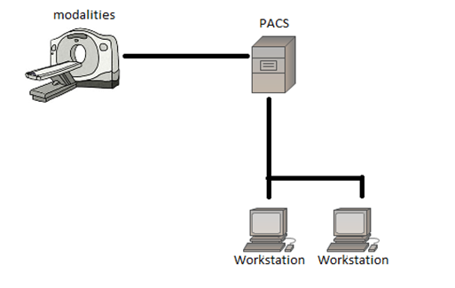
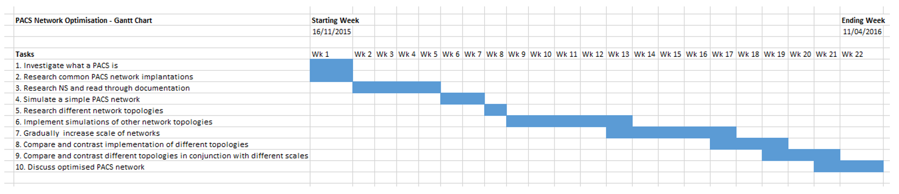

# Introduction

A Picture Archive Communication System (PACS) is a system which is comprised of medical imaging scanners (for example: CT or MRI scanner), storage mechanisms, information communication technologies, displays and clinical workflow. A PACS network is the combination of PACS systems and nodes (computers) accessing storage of images, at any time image files (often many) can be requested for viewing or being saved to storage mechanisms.

The concept of digital communication and digital radiology was introduced in the late 1970s and early 1980s, the beginning of PACS was attributed to development in the USA where research was contributed by laboratories within universities and small companies in the private industry which had entered the field in 1982. In the early years of PACS evolution research and development varied on region in which it was conducted; PACS research in North America was largely supported by government agencies and manufacturers (Huang, 2011). Research in Europe was supported through multi-national efforts, PACS components weren’t as accessible in Europe as N.A. and Asia so research emphasized on modelling and simulation. PACS research in Asia was led by Japan which treated the research as a national project, resources were distributed to many manufacturers and university hospitals (Lemke, 2011).

A PACS network often has many workstations and modularity’s sending large amounts of packets of information around, being requested for viewing or being stored in PACS archives, (Santos, et al., 2015) highlights this, although their research was oriented around DICOM metadata, there was a clear pattern of more images being produced year by year, all of which needs to be stored with redundancy in mind. With all this data being transmitted and received on the network, optimisation of how these nodes communicate would prove valuable for increased network performance.

Due to large image files being requested or being stored, network bandwidth can often be limited which causes slowness of the network, slowing workflow and potentially causing a lower quality of service for patients. As a PACS network can often consist of multiple storage mechanism’s which allow for data redundancy, bandwidth can be further limited.

This project aims to simulate a PACS network with clinical workflow in mind, but to also simulate a PACS network comprised of different network topologies and scales of implementation (small scale to larger scale networks). Further simulating these different topologies and scales of implementation it is hoped that useful data which can be obtained to further compare and contrast different network topologies across different network sizes, by doing so it is hoped to achieve an optimized network architecture for the PACS context.
## Network Simulators

Research into finding a suitable application to simulate these networks had some factors to be taken into consideration, the application has to be open source so that modifications can be made if and when necessary so that the simulation is tailored to PACS and clinical workflow, because of this proprietary software would not be suitable as it is often not possible to see source code and may have restrictions on its use.

The simulation software needs to be capable of modelling different network topologies, different network sizes, logging the packets (data which is sent between nodes) being transmitted on the network, visualisation of packet flow would also be highly beneficial for analysis and to also output the performance of the network in metric values which can be analysed and later used for comparison.

There are numerous research applications which cater to the purpose of simulating networks and network traffic analysis, through researching for a suitable application the most common were: NS (Often referred to as NSNAM), OPNET and NetSim. Each come with their similarities and differences but ultimately their aims are the same.

***NS***

NS (Network Simulator) is the name for a series of applications which are discrete event network simulators (Events take place at a particular time and affect the state of the system), NS is primarily used for research and there is a lot of documentation which can be used assist the development of this projects aims. NS is licensed as GPLv2 which means it is publically available for research, development, and use, so any modifications to its source code can be made if necessary.

***OPNET***

OPNET (Optimized Engineering Tools) is a network simulation tools with many features and tools which include; Packet definition (used to define protocols), node modelling (used to specify network component interfaces, for example; Workstations, switches, servers…), a project window (used to define network topologies, node links etc..) and a simulation window which has the capability to capture and show results of an simulation. OPNET is a commonly used application in network research and development, however, as OPNET is proprietary software accessing and modification of the programs source code is not an option and to use this software a license would be required, making OPNET not suitable for this project.

***NetSim***

NetSim is another popular network simulator which is used for network research and development. NetSim offers network modelling and simulation services in many protocols and technologies, the protocol libraries which offer this are available with C source code so they can be modified to suit requirements at hand. NetSim is packaged with a built-in development environment which is used to bridge user’s code with the protocol libraries and simulation kernel, This environment also allows for a simulation to be started, and single-step, step-in and step-over functions to be run by using pre-determined breakpoints marked by the user. Whilst NetSim does offer C source code for its protocol libraries it is proprietary software which will require a license to be used, making NetSim not suitable for this project.

***Comparison of simulators***

Whilst the discussed network simulators have functionality which is similar across all of them, they do have distinct differences, such as how user created network scenarios are parsed through their respective simulation kernels, NS requires a lot of knowledge to create and simulate a network as it is mainly command line oriented and files need to be wrote outside of a dedicated development environment, however, as NS is quite prominent in research papers I found a lot of documentation and tutorials on how to use the software. OPNET uses an GUI which does reduce the time that needs to be taken to learn the software, as OPNET is considered a mature tool for network simulation there is a lot of documentation and tutorials available online, however, for this project it would be beneficial to be able to access and modify source code, which cannot be done with OPNET, making it unfavourable for this project. NetSim is another popular solution to simulate networks and provides a useful GUI and built-in development environment for creating scenarios, NetSim does offer open source libraries for its protocols but can be restricting as it is propriety software which will require licencing for this project, making it unfavourable compared to NS which is completely open source and does not require licensing to use.
## NS2 (Network Simulator 2)

NS2 is the second version of the NS open source network simulators and is respectively one of the most popular, as previously discussed. NS2 is widely used in academia and has got a lot of packages available for use, because of NS2’s popularity documentation is updated often and features are well documented.

NS2 is an object-oriented, discrete event driven simulator, using C++ and OTcl (Tcl script language with Object-oriented extensions). NS2 was originally developed at the University of California-Berkely. The main reasoning to implementing C++ and OTcl is because of C++’s efficiency when implementing a design but not when it comes to visualising and graphically displaying the designed network, as C++ is efficient the code written and compiled does reduce packet and event processing time. Because C++ is not very effective at visualisation OTcl is used for controlling simulation scenarios, set up network topology and to schedule events while C++ is used to define protocols, this combination of the 2 languages proves very effective.

# Review of academic literature

The purpose of this project is to simulate and review different network topologies to define an optimised network for the PACS scenario, the scope of academic literature reviewed was in relation to PACS network performance and measuring network performance using NS2. The literature reviewed is sorted by ascending publication year.

*Uw PACS Prototype Performance Measurements, Computer Model, and Simulation*

**(Panwar, et al., 1990) **Discussed their early efforts on simulating different PACS network architectures by creating models with NS2. From their studies they identified parameters in their model which would prove useful for this project such as;

- Image Acquisition Time: This is the time taken to receive and display an image packet, this time differs depending on the source (MRI, CT scanner) as the image may be larger or consist of many images.

- Local Disk Access Time: This is the read/write time for a packet on the local machine (workstation), while their transfer rate was 0.25Mbyte/s in modern advances transfer rates have increased drastically.

- Compression/ Decompression time: This is the time taken to compress, decompress image packets, this depends on the compression technique used, for example: JPG.

- Transmission Time: This is the time taken to transmit a packet between 2 nodes. Transmission time is the result of a link between 2 nodes this link could be a CAT5 cable or fibre optic cable.

Their research also discussed other parameters on their network such as traffic distributed from modularity’s on the network and the amount of images/packets in which these machines transmit. Whilst they were able to discover bottlenecks with scaling up their own network (implementing a star topology). The most considerable limitation discovered was the compression and decompression time of their hardware, transmission time was not found to be a bottleneck in their research. The parameters mentioned can still be applied to more modern networks, however, as technology has been advanced over time (more optimised compression techniques and hardware), the bottlenecks they have found may not be a bottleneck in more recent PACS networks.

*Performance Evaluation of a Picture Archiving and Communication Network Using Stochastic*

**(Martinez, et al., 1990) **Investigates star networks but also takes a range of workloads into consideration for measuring performance, more specifically implementing fibre-optic as the link between nodes, See Fig. 3. For example.

Components in their PACS network consisted of imaging equipment, viewing workstations and a PACS archive system, the model simulated consisted of one star network, in reality a PACS network could consist of multiple star networks, for different departments.

The workflow used in simulations was a patient is admitted for a procedure session, images are generated from that session. The images taken during that session are stored locally on the imaging equipment, once the procedures are complete there is then a request for the images to be stored on the PACS archive system, which is then queued on that system. Once the PACS archive system was ready to receive and store said images, it would then send a connection granted packet and transmission would begin.

The assumed workload described by (Martinez, et al., 1990), consisted of imaging equipment and workstations generating requests. There was 2 types of requests identified; the first requesting for the transfer of images and the second which requested patient information. For their study it was assumed that 94% of requests are for the transfer of images with the remaining 6% being for patient information. This was used to create probabilities of which type of request is sent at any time on the network, which adds another useful parameter to their simulation and helps to represent a PACS with workload demands.

It was concluded that the passive star topology responded well with scaling (up to 35 machines), with minimal packet collisions. It was discussed that different methods of connecting multiple star networks is a field of research which could be expanded and studied. The connection of star networks could be implemented by a backbone network.

*Picture Archiving and Communication System (PACS) Characteristic on Wired-line and Wireless Network for Traffic Simulation *

**(Chimmanee & Patpituck, 2013) **Explores PACS traffic characteristics of wired and wireless networks, while wireless networks are out of the scope of this project, (Chimmanee & Patpituck, 2013) does introduce the parameter of packet loss in their simulations. While it was found that wired networks did not experience packet-loss as prominently as wireless, it should be a parameter taken into consideration during the PACS Network Optimisation project as it is a factor experienced in a PACS network environment.

Packet-loss was measured by distributing flows of data, packet sizes ranging from 54 bytes to 1518 bytes in flows of 1 to 6, the highest volume of packets where found to be in the range of 1024 to 1518 bytes, which accounted for 60% of data being transmitted. Second highest being packets within the range of 54 to 64 bytes with accounted for 30% of data being transmitted. Third highest being 512 to 1023 bytes which accounted for 9% of  data being transmitted and packets between 128 and 511 bytes accounted for the final 1%.

This information will prove useful for assigning probabilities of which size packet will be transmitted through the PACS network, generating a more accurate simulation of traffic.

***Conclusion***

While star networks have been extensively investigated by (Martinez, et al., 1990) and (Panwar, et al., 1990), there still is a gap in research of simulating multiple star networks with a backbone architecture. Possible parameters for the simulation have been identified, most prominently from (Panwar, et al., 1990)’s simulation of their own PACS network. It would appear that there still could be more research into different topologies other than the most popular star network. As some of the literature was not published in more recent years, investigation into more recent protocols for connecting nodes in a LAN could be identified and explored. Overall the literature shows there are gaps in relation to simulating modern PACS network topologies with increased scales.
# Aims of the project

Below the project has been broken down into small milestones which progress of each milestone can be monitored easier and achieved, further to this there is a breakdown and brief description of each milestone.

- Investigate what a PACS is

It is planned to investigate what a PACS is and how it functions in the real-world application.

- Research common PACS network implementations

Research how PACS networks are currently implemented to get an understanding of the different ways they are implemented.

- Research NS2 and read through documentation

NS2 has a steep learning curve so reading documentation on NS2 will be vital to this project being successful, as NS2 is well established there are a lot of up-to date tutorials and support.

- Simulate a simple PACS network

To start off it is planned to simulate the up most basic PACS network as previously seen in Fig. 1. This will be the starting point to other more complex simulations, involving different topologies and scales.

- Process of creating a simulation:

The process of creating a simulation can be broken down into 7 steps which can be seen bellow, each of these steps will need to be followed for a successful implementation of a simulation

- Topology definition: define relationships between nodes.

- Model development: models are added to simulation.

- Node and link configuration: models set their default values (for example, the size of packets sent by an application or bandwidth of a link between nodes).

- Execution: network is simulated and events are run, data requested is logged.

- Performance analysis: once the simulation is completed and data is available as a time-stamped event trace.

- Graphical Visualization: visualisation of the network is achieved.

- Implement simulations of other network topologies, such as star, mesh, server-client and ring etc.)

Following the process of creating a simulation as discussed above, networks of different topologies will be simulated.

- Gradually increase scale of networks

From implementation of different network topologies, the scale of said simulations will be gradually increased, to see how each topologies handles traffic.

- Compare and contrast implementation of different topologies

The performance of the different network topologies will be assessed from results obtained from the simulations.

- Compare and contrast different topologies in conjunction with different scales

Measure the performance of the different network topologies by also with the factor of an increased scale.

- Find an optimised PACS network

Once all the milestones above are completed it is hoped that an optimised PACS network can be identified and documented.
# Project plan

A project plan is essential for a successful project, risks need to be identified as well as risk mitigation, below is the Gantt chart in which time has been allocated for each of the aims of the project, as well as, a risk matrix which identifies possible risks to the project and how they may be mitigated.

It is planned to schedule weekly meetings with the project supervisor to ensure the goals of the project are met on time and any issues are mitigated.
## Gantt chart

The Gantt chart below is comprised of summerised tasks with a timeframe in which they should  be completed, Some tasks overlap as they may be finished early in the week and the next task will be started.

## Project risks

# Project Risk Assessment
## Risk Register

# Risk Assessment

## 1. Loss of data
- **Likelihood:** Low  
- **Impact:** High  
- **Mitigation:** Perform regular backups on external storage after each work session.

## 2. Time taken away due to other assignments and exams
- **Likelihood:** Medium  
- **Impact:** Medium  
- **Mitigation:** Allocate time effectively and follow the Gantt chart to complete weekly tasks.

## 3. Ineffective implementation of simulations in NS2
- **Likelihood:** Low  
- **Impact:** High  
- **Mitigation:** Read NS2 documentation and follow tutorials.

## 4. Difficulty using a new operating system
- **Likelihood:** Medium  
- **Impact:** Medium  
- **Mitigation:** Use online tutorials and support forums to troubleshoot issues.

## 5. Not achieving initial goals
- **Likelihood:** Medium  
- **Impact:** High  
- **Mitigation:** Hold regular meetings with the project supervisor and follow the Gantt chart.

## 6. Slower-than-expected progress with NS2
- **Likelihood:** Low  
- **Impact:** High  
- **Mitigation:** Use a different network simulator based on research into alternatives.

# References

Chimmanee, S. & Patpituck, P., 2013. *Picture archiving and communication system (PACS) characteristic on wired-line and wireless network for traffic simulation. *s.l., IEEE, pp. 589-594.

Huang, H., 2011. Short history of PACS. Part I: USA. *European Journal of Radiology, *78(2), pp. 163-176.

Lemke, H. U., 2011. Short history of PACS (Part II: Europe). *European Journal of Radiology, *78(2), pp. 177-183.

Martinez, R. et al., 1990. *Performance evaluation of a picture archiving and communication system using stochastic activity networks. *s.l., International Society for Optics and Photonics, pp. 167-178.

Pan, J., 2008 . *A Survey of Network Simulation Tools: Current Status and Future Developments. *[Online]
Available at: [http://www.cse.wustl.edu/~jain/cse567-08/ftp/simtools/index.html#51](http://www.cse.wustl.edu/~jain/cse567-08/ftp/simtools/index.html#51)
[Accessed 12 November 2015].

Panwar, R. et al., 1990. *UW PACS prototype performance measurements, computer model, and simulation. *s.l., International Society for Optics and Photonics, pp. 869-880.

Santos, M. et al., 2015. DICOM Metadata Access, Consolidation and Usage in Radiology Department Performance Analysis. A Non-proprietary Approach. *Procedia Computer Science, *pp. 651-658.
