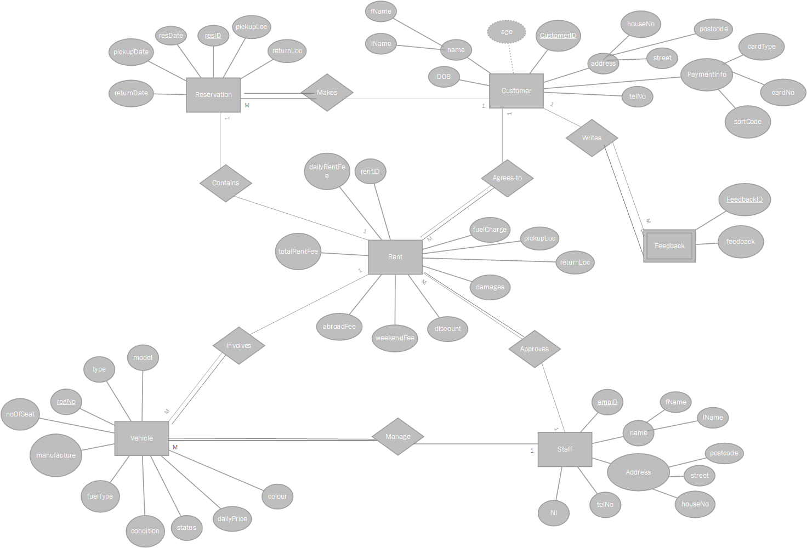
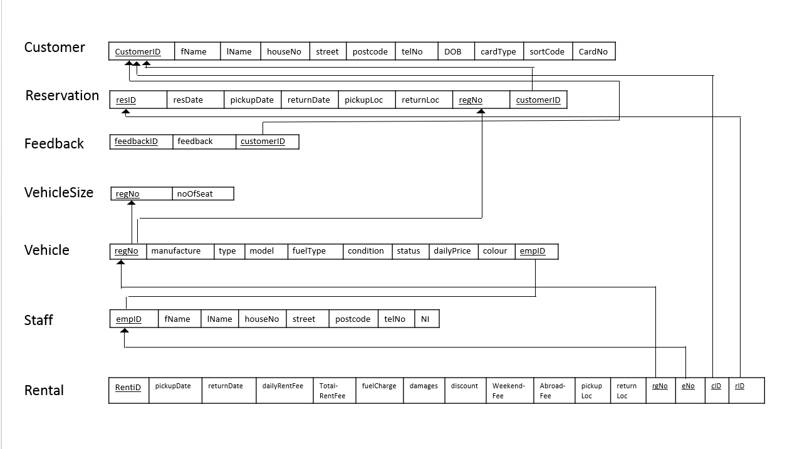

You have been contracted to design a database for a car rental company called "Lincoln Vehicle Rent" based in Lincolnshire.
The company needs to provide full rental service which includes keeping track of customers, cars, orders and staff. Your database solution should offer the opportunity for customers to specify particular parameters about what they are looking to rent. They should have the possibility to rent one or multiple cars for the same customer; a customer might be a company or an institution, but you might have a cap on the number of rented vehicles. A customer should have the ability to pick up and drop off the vehicle in different locations.
# Table of Contents

[Appraise and analyse the scenario](#_Toc403647077)
[-What information the customer should provide to rent a vehicle](#_Toc403647078)
[-What information Lincoln Vehicle Rent should provide about the vehicle](#_Toc403647079)
[-What information Lincoln Vehicle Rent needs to know from the customer to complete the renting process](#_Toc403647080)
[-Identifying brief entities (nouns), attributes and relationships (verbs)](#_Toc403647081)
[Functional Requirements](#_Toc403647082)
[-Reservation](#_Toc403647083)
[-Vehicle](#_Toc403647084)
[-Rental](#_Toc403647085)
[-Feedback](#_Toc403647086)
[Dataflow diagrams](#_Toc403647087)
[-Context Level DFD](#_Toc403647088)
[-Level-1 DFD](#_Toc403647089)
[Initial conceptual design](#_Toc403647090)
[-Preliminary Design of Entity Types](#_Toc403647091)
[-Preliminary Design of Relationship Types](#_Toc403647092)
[Entity-Relational (ER) model](#_Toc403647093)
[Mapping the ER Model](#_Toc403647094)
[-Output of the mapping process](#_Toc403647095)
## Appraise and analyse the scenario

Having read the scenario I have been contracted to design a system for a car rental company called “Lincoln Vehicle Rent” which is based in Lincolnshire. The company aims to provide a full rental service which includes tracking its customers, cars, orders and staff. The database needs to allow the customer to set parameters to find the type of vehicle they wish to rent. The customer should be able to rental multiple vehicles, but also may be limited to how many vehicles they may be able to rent at any given time. The customer also needs to be able to decide where the vehicles are picked up and dropped off.

The system needs to apply restriction or conditions based on their vehicles and what driving licence categories the customer is entitled to drive, insurance policy and the customer’s age. The system will need to be able to check the values the customer enters against what vehicle the customer wants to rent, to ensure they qualify to rent their selected vehicle.

The system will need to be able to track the status of the company’s  vehicles to determine what state they are in, whether it may be rented, being serviced, cleaned, sold, scarped or even stolen. So the system will need to have records of all vehicles they own, information regarding the vehicles and including their current state.

The system needs to be able to store details regarding inspection of the vehicle, this may include the member of staff who made the inspection, was the customer present during the inspection, details of where there are dents and scratches etc. on the vehicle. These details need to be noted on the rental agreement. This process will need to be repeated when the customer drops off the vehicle so that if any new dents, scratches etc. are present on the vehicle the customer will be held liable for the repair costs.

The system needs to be able to record feedback from the customers for the purpose of marketing and enhancing their services in addition to their complaints, the system should also  be able to store the level of demand for their vehicles based on colour, make and size. The system could use this system for built in analytics such as graph’s based on the most popular vehicle, most popular colour vehicle rented etc. so that this information can be easily used by the company for their future growth plan.

The system needs to allow staff to process the renting and checking in and out of the vehicle selected for rental, the system needs to be able to display the status of their vehicles and allow them to manage the stock of their vehicles.
### What information the customer should provide to rent a vehicle

 	* Pick up and drop off location

 	* Date in which they want to rent the vehicle as well as duration

 	* Vehicle type/class

 	* Date of birth

 	* Driving License Category Type(s)

### What information Lincoln Vehicle Rent should provide about the vehicle

 	* Engine size

 	* Whether its automatic or manual

 	* Fuel type

 	* Number of seats

 	* Mileage of the vehicle

 	* Car model/type

 	* Vehicle class

### What information Lincoln Vehicle Rent needs to know from the customer to complete the renting process

 	* Full Name

 	* Contact details i.e. Contact numbers and current address

 	* Payment details

 	* Driving License

 	* Pick up and drop off locations

### Identifying brief entities (nouns), attributes and relationships (verbs).

Scenario:  You have been contracted to design a database for a car rental company called “Lincoln Vehicle Rent” based in Lincolnshire.

The company needs to provide full rental service which includes keeping track of customers, cars, orders and staff. Your database solution should offer the opportunity for customers to specify particular parameters about what they are looking to rent. They should have the possibility to rent one or multiple cars for the same customer; a customer might be a company or an institution, but you might have a cap on the number of rented vehicles. A customer should have the ability to pick up and drop off the vehicle in different locations.

The company should have some conditions/ restrictions based on vehicles and customer driving licence, insurance policy and customer age.

Something you need to consider when you calculate the rental price: offering discount, exceeding limited mileage, weekend rate and travelling into another country.

The company needs to track the status of their vehicles as they might be rented, under service, cleaning, sold, scraped, stolen, etc.

A member of staff with the customer will inspect the vehicle carefully on collection and any scratches, dings, dents or scuffs will be noted on the rental agreement. This inspection will be carried out again when the customer returns the vehicle and the customer will be liable for any repair or refurbishment costs in the case of damage or vandalism.

The company needs to record some feedback and rating from their customers for the purpose of marketing and enhancing their services in addition to their complaints. Also they are interested to know the level of demand on their vehicles based on colour, make, size, etc.; as that will be used for their future growth plan.

Staff should be able to process the renting and checking in and out of vehicle. Also they should maintain the status of their vehicles and manage their stock of vehicles.
## Functional Requirements

### Reservation

 	* The system must allow the customer/institution to register for reservation

 	* The system shall allow the customer to view details of selected vehicle

 	* The system must notify if the selected vehicle is unavailable

 	* The system shall allow the customer to rent more than one vehicle

 	* The system must allow the customer to specify particular parameters about what they are looking to rent

 	* The system must notify the customer if they have exceeded the maximum number of vehicles they may rent

 	* The system must notify if customer cannot rent a certain vehicle because of their age, driving license entitlements and insurance policy

 	* The system must list all available vehicles

 	* The system shall allow the customer to cancel their reservation using their reservation-ID

 	* The system shall allow the customer to state pick up and drop off locations

### Vehicle

 	* The system must allow staff to register new vehicles

 	* The system shall allow customers to view vehicles on the list

 	* The system shall allow staff to view vehicles on the list

 	* The system shall allow staff to search for vehicles by reference

 	* The system shall allow customers to search for vehicles by reference

 	* The system shall allow staff to view a list of available vehicles

 	* The system shall allow customers to view a list of available vehicles

 	* The system shall staff to view a list of unavailable vehicles

 	* The system shall allow staff to update the condition of the vehicle (scratches, dents, etc.)

 	* The system shall allow staff to update the state of the vehicle (serviced, cleaned, sold, scarped or stolen)

### Rental

 	* The system shall allow staff to enter customers onto the rental list

 	* The system shall allow the staff to manage the customer rental records on the customer rental list

 	* The system shall allow staff to apply discounts, apply weekend rates

 	* The system shall manage whether the rental agreement allows travel out of the country

 	* The system shall allow staff to see whether the limited mileage is exceeded

 	* The system shall allow staff to see all customer rental records

 	* The system shall allow staff to see which customers rent vehicles

 	* The system shall allow staff to see which customers are currently renting a vehicle, the quantity of vehicles being rented and the cap

### Feedback

 	* The system shall allow customers to enter feedback

 	* The system shall record the customers vehicle information

 	* The system shall allow staff to view feedback

 	* The system shall allow staff to view analytics, such as graphs of demand of vehicle colour

## Dataflow diagrams

### Context Level DFD

### Level-1 DFD

## Initial conceptual design

Here I have provided a description on the entities with a preliminary design of the entity types and their relationships.

**Entity Name**
**Definition**

Staff
Is a strong entity is responsible for managing Vehicles, Rental Agreements and Reservation information, and needs to store staff details

Customer
Is a strong entity makes reservations on vehicles and stores customer details

Reservation
Is a strong entity checks whether a vehicle is available for rent and stores reservation applications

Rent
Is a strong entity is where rental agreements are made and stored

Vehicle
Is a strong entity is where the vehicle details. state and condition are stored

Feedback
Is a weak entity which relies on the customer. feedback from the customer is stored and processed into analytics such as graphs for the staff

### Preliminary Design of Entity Types

**Entity Name**
**Attributes**

Staff
(empID, name, address, telNo, NI

Customer
(customerID, name, address, telNo, DOB, paymentInfo)

Reservation
(resID, Res_date, pickupDate, returnDate, pickupLoc, returnLoc, regNo,  customerID)

Rent
(rentID, rentDate, returnDate, dailyRentFee, totalRentFee, fuelCharge, damages, discount, weekendFee, abroadFee, pickupLoc, returnLoc, regNo, empNo, customerID, resID)

Vehicle
(regNo, manufacture, type, model, noOfSeat, fuelType, condition, status, dailyPrice, colour, empID)

Feedback
(feedbackID, feedback, customerID)

### Preliminary Design of Relationship Types

 	A staff member approves a many rental agreements

 	* Staff (1:M) Approve

 	* Some of the staff are participating in this relationship

 	* All of the rental agreements are participating in this relationship

 	A staff member adds/ updates many vehicle records

 	* Staff (1:M) manages

 	* Some of the staff are participating in this relationship

 	* All of the reservations are participating in this relationship

 	A Customer makes many Reservations

 	* Customer (1:M) applies for

 	* Some of the customers are participating in this relationship

 	* All of the vehicles are participating in this relationship

 	A Customer may agree-to many rental agreements

 	* Customer (1:M) agrees-to

 	* Some of the customers are participating in this relationship

 	* All of the Rental agreements’ are participating in this relationship

 	A Reservation may be for more than one vehicle

 	* Reservation (1:M) involves

 	* Some of the reservations are participating in this relationship

 	* All of the vehicles are participating in this relationship

 	A Rental Agreement has one reservation

 	* Rental Agreement (1:1) contains

 	* Some of the rental agreements are participating in this relationship

 	* Some of the reservations are participating in this relationship

 	A Rental Agreement may have many vehicles

 	* Rental Agreement (1:M) involves

 	* Some of the rental agreements are participating in this relationship

 	* All of the reservations are participating in this relationship

 	A customer gives write more than one feedback

 	* Customer (1:M) writes

 	* Some of the customers are participating in this relationship

 	* All of the feedback are participating in this relationship

## Entity-Relational (ER) model

## Mapping the ER Model

Step 1: Mapping of Regular Entity Types

**Entity Name**
**Attributes**

Staff
(empID, NI

Customer
(customerID, DOB)

Reservation
(resID, resdate, pickupDate, returnDate, pickupLoc, returnLoc)

Rent
(rentID, dailyRentFee, totalRentFee, fuelCharge, damages, discount, weekendFee, abroadFee)

Vehicle
(regNo, manufacture, type, model, dailyPrice)

Feedback
(feedbackID, feedback)

Step 2: Mapping of Weak Entity Types

Feedback
(feedbackID, feedback, customerID)

Step 3: Mapping of Binary 1:1 Relationship Types

Reservation
(rentID, dailyRentFee, totalRentFee, fuelCharge, damages, discount, weekendFee, abroadFee, resID)

Step 4: Mapping of Binary 1:N Relationship Types.

Reservation
(resID, resdate, pickupDate, returnDate, pickupLoc, returnLoc, regNo,  customerID)

Rental
(rentID, pickupDate, returnDate, dailyRentFee, totalRentFee, fuelCharge, damages, discount, weekendFee, abroadFee, pickupLoc, returnLoc, regNo, empNo, customerID, resID)

Vehicle
(regNo, manufacture, type, model, fuelType, condition, status, dailyPrice, colour, empID

Step 5: Mapping of Multi-valued attributes.

VehicleSize
regNo, noOfSeat

### Output of the mapping process

