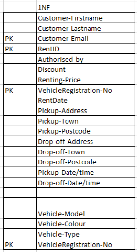
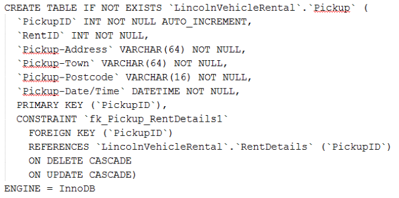
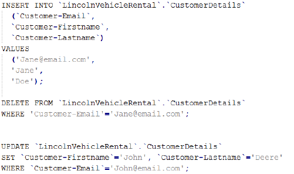
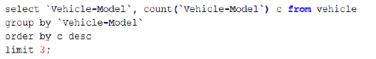

Database Normalisation and informal design guidelines follows on from "[Database planning of modules and mechanisms](https://www.joshuarobbins.tech/database-planning-modules-mechanisms)", this time I am required to apply Normalisation upon my database design, discuss the Four informal design guidelines that may be used as measures to determine the quality of relation schema design as well as show sample SQL statements.

## The Four informal design guidelines that may be used as measures to determine the quality of relation schema design

### Guideline 1: Each record in a relation should represent one entity or relationship instance

This guideline is to design a relational schema so that its meaning is easily explained. Another goal of this guideline is to not combine attributes from multiple relationships and entity types into a single relation. Information should not be stored redundantly therefore preventing storage being wasted, only foreign keys should be used when referring to other entities.

### Guideline 2: No insertion, deletion, or modification anomalies are present in the relations

This guideline is to help design the database relation schema so that there are no insertion, deletion or modification anomalies present in the relations, improper groupings of attributes into a relation schema will result in wasted storage, insert anomalies, delete anomalies and modification anomalies.
### Guideline 3: Relations should be designed such that their records will have as few NULL values as possible

This guideline is to help prevent placing attributes in a database relation which value may frequently be null, however, if nulls are unavoidable they should apply in exceptional cases only and not the greater part of values in a relation. Problems with having null values are as follows: wasting of storage space, Problems with understanding the meaning of attributes, Problems with applying certain aggregate function and also problems with JOIN operations.

As a result of applying normalisation the schema has got minimal attributes which may be null, the only attribute that may be null is the Discount attribute within the table VehicleRental.

### Guideline 4: Design relation schemas so that they can be joined with equality conditions on attributes that are either primary keys or foreign keys in a way that guarantees that no spurious records are generated

This guideline is to help design a relational schema so that it can be joined with equal conditions of attributes that are either primary keys or foreign keys in ways that will guarantee that no spurious records are generated. To stop generations spurious records, relations should no contain matching attributes other than the foreign/primary key relation, however, if such relations are unavoidable they should not be joined on such attributes because the join may create spurious records.

## Key attributes for Renting Vehicle relation and its functional dependencies

In this task key attributes (candidate keys, primary keys, prime attributes and non-prime attributes) need to be identified within the RentingVehicle relation. Below is the RentingVehicle relation:

RentingVehicle: {Customer-Firstname, Customer-Lastname, Customer-Email, RentDate, Authorised-by, Vehicle-Model, Vehicle-Colour, Vehicle-Type, VehicleRegistration-No, Discount, Renting-Price, Pickup-Location, Drop-off-Location, Pickup-Date/time, Drop-off-Date/time}.

Candidate keys:

- {VehicleRegistration-No}
- {Customer-Email}
- {RentDate, VehicleRegistration-No}
- {RentDate, VehicleRegistration-No, Customer-Email}

Primary key:
- {RentDate, VehicleRegistration-No, Customer-Email}

Prime attributes:
- {RentDate, VehicleRegistration-No, Customer-Email}

Non-prime attributes:
- {Customer-Firstname, Customer-Lastname, Authorised-by, Vehicle-Model, Vehicle-Colour, Vehicle-Type, Discount, Renting-Price, Pickup-Location, Drop-off-Location, Pickup-Date/time, Drop-off-Date/time}

Functional dependencies:
- {VehicleRegistration-No -> Vehicle-Model}
- {VehicleRegistration-No -> Vehicle-Colour}
- {VehicleRegistration-No -> Vehicle-Type}
- {Customer-Email -> Customer-Firstname}
- {Customer-Email -> Customer-Lastname}

## The normalisation process for the RentingVehicle relation

Normalization is a technique in which data is organised in the database, normalisation is an approach in which tables are decomposed to prevent data redundancy and unwanted characteristics such as Insertion, Modification and Deletion anomalies.

Without applying normalisation, handling and updating the database will become harder, and may result in loss of data, insertion anomalies, deletion anomalies, and modification anomalies.
### Un-Normalised Form – UNF

Below is the data in UNF, UNF is the preparatory stage of normalisation as each stage is dependant upon the previous.

### First Normal Form - 1NF

In First Normal Form (1NF) there cannot be any rows of data in which repeating groups of information can be stored, each column must contain unique data. Each table should be organised into rows, with a primary key which makes it unique.

Above are the 2 tables which have been generated by applying 1NF, because the customer can rent upto 5 vehicles at a time, so a separate table has been generated to contain all the vehicles which can be rented. The primary key for the first table is made up of {Customer-Email, RentID, VehicleRegistration-No} as that is unique. To ensure all  data is atomic Pickup-Location has been broken down into {Pickup-Address, Pickup-Town, Pickup-Postcode} and Drop-off-Loction has been broken down into {Drop-off-Address, Drop-off-Town, Drop-off-Postcode}
### Second Normal Form - 2NF

In Second Normal Form (2NF) there cannot be any partial dependency of any of the columns on a primary key, meaning all non-key attributes of the table must depend on all parts of the primary key.

By applying 2NF there are now 4 Tables: CustomerDetails, VehicleRental, Vehicle and RentDetails.

### Third Normal Form - 3NF

In Third Normal Form (3NF) every non-prime attribute of the table must be dependent on the primary key (just like in 2NF) but also any transitive functional dependency should be removed from each table. The purpose of removing transitive dependency is that data duplication is reduced and data integrity will be achieved.

By applying 3NF, 2 new tables have been created Drop-off and Pickup, these have been created to remove transitive dependency

## SQL statements for defining the database solution

Below are the SQL statements for defining the database solution
- Create “Lincoln Vehicle Rent" database.
  - `CREATE SCHEMA LincolnVehicleRent AUTHORIZATION A1;`
- Create your 2 tables from your design, including data types, integrity constrains of relationships between tables; with enforcing integrity on each relationships.

- Change the definition of one of your tables by adding at least one attribute constraint and one table constraint.

- Granting account A1 the privilege to insert and delete tuples in vehicle relation with the ability to propagate these privileges to additional accounts

- Revoking account A1 the privilege granted to insert tuples in customer relation.

## SQL statements for manipulating the database

- Inserting a valid record for the customer table; deleting records for the customer table; editing records in the customer table

- List of the most favourite vehicle-make for customers.

