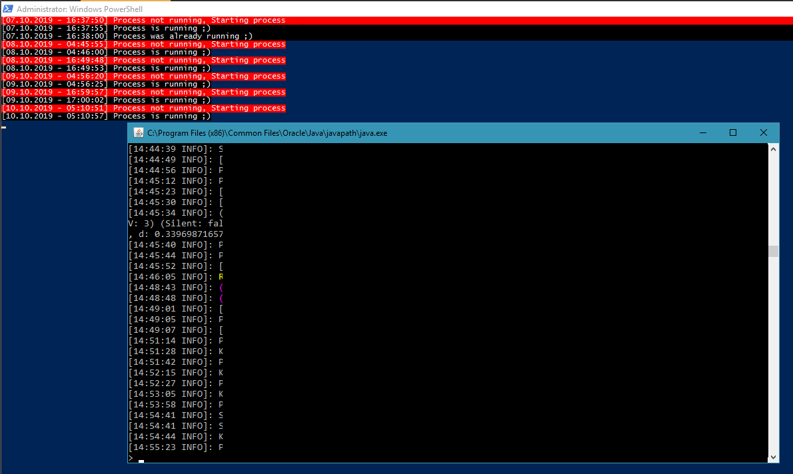

## About

The script was created to monitor a Minecraft server process on the host server (in this case Windows 2016). I also wanted the script to be capable of logging when the server started and stopped (intentionally or not). The script checks every 5 seconds to see whether Java is running, in the case Java is not running the script will call a function which attempts to start a Java process with the desired flags for the server (Such as RAM allocation...).
## Improvements

A couple things could be improved; such as the ability to define flags for the server such as RAM allocation and other features relating to the Java instance. I also looked into the possibility of the script emailing upon a number of failed attempts, but I decided to use a [third party tool](https://www.statuscake.com/) to monitor the server port remotely which will email myself in the event of inaccessibility (This works better as the server can be tested from nodes across the internet and allows for a more inclusive test, such as DNS issues and other networking problems).

I also run a MySQL instance in parallel with the game server for other plugins, so I may well integrate with that so I can conduct analysis of the servers restarting (time taken to startup and unexpected shutdowns for example).
## Persistence

To automate the starting of the game server you could create a batch wrapper which runs the PS1 file (as Windows will not run PS1 files directly through shortcuts), personally I use Scheduled Tasks through Windows Task Scheduler to start the server when the machine starts. Using Windows Task Scheduler in conjunction with [AutoLogon](https://docs.microsoft.com/en-us/sysinternals/downloads/autologon) can assist to create persistence in the event the virtual machine powers down, AutoLogon allows you to securely define an account for the machine to sign into on automatically startup (I would strongly recommend a service account used only for this purpose).
## Plugin Considerations

I currently use a plugin on the game server to send a stop command to conduct scheduled restarts (through the use of this script to bring to server up), this is useful to keep the Ticks-Per Second (TPS) of the server high and reduce lag. There are plugins which can be used to create a CRON job to automate this but your choice will ultimately depend on the server type and the game version.


