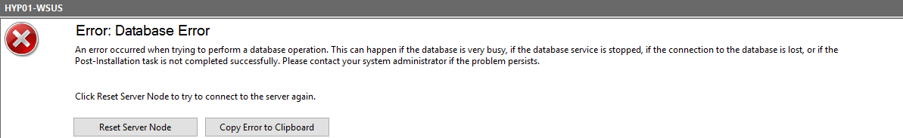
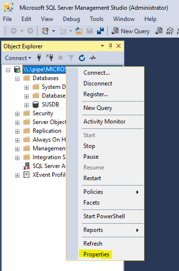
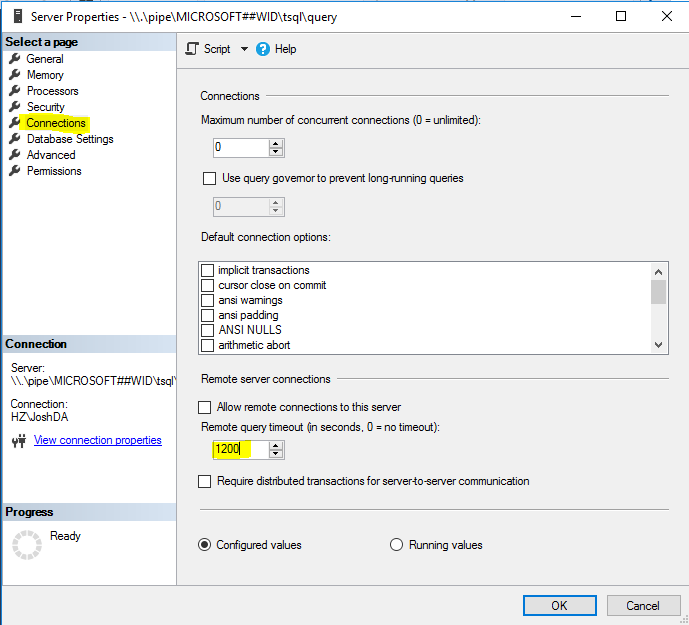

Whilst trying to cleanup and remove older Windows updates to free up space on my WSUS box I ran into the issue of WSUS crashing with the following exception:

The WSUS administration console was unable to connect to the WSUS Server Database.
Verify that SQL server is running on the WSUS Server. If the problem persists, try restarting SQL.

System.Data.SqlClient.SqlException -- Execution Timeout Expired. The timeout period elapsed prior to completion of the operation or the server is not responding.

Source
.Net SqlClient Data Provider

Stack Trace:
at System.Windows.Forms.Control.MarshaledInvoke(Control caller, Delegate method, Object[] args, Boolean synchronous)
at System.Windows.Forms.Control.Invoke(Delegate method, Object[] args)
at Microsoft.UpdateServices.UI.SnapIn.Wizards.ServerCleanup.ServerCleanupWizard.OnCleanupComplete(Object sender, PerformCleanupCompletedEventArgs e)

Which from my understanding the query is taking too long to complete and the SQL server is simply timing out... To correct this we need to connect to the WID and extend the timeout time.

Steps to increase the query timeout time:

 	* Connect to the WID ([Steps here](https://blog.joshuarobbins.tech/?p=219))

 	Right-Click the SQL instance and select properties

 	Go to connections, then modify the timeout time to 1200 or greater (0 can prevent timeouts but is not recommended

