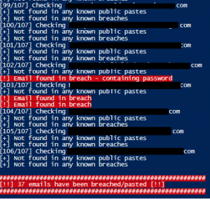

This small project uses Troy Hunts' [Have I Been Pwned](https://haveibeenpwned.com/) fantastic (API) service along side a [PS module](https://www.powershellgallery.com/packages/HaveIBeenPwned/3.0.1) which parses the JSON from the API. The purpose of this script is to read in emails addresses from file and then check them against HIBP to see if they are apart of any breaches or public pastes.

You will need a API key to make use of this API, but they are inexpensive. This script came about because I wanted to generate a custom report on a number of emails and because it was fun to make.

The script makes a number of CSVs which detail the breaches found and if there are any public pastes found.


