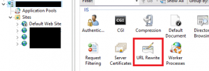
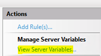
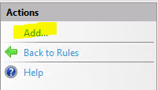

You may want to remove the server version from your HTTP response for security reasons, there are a couple ways you can go about this depending on how the header is being handled.
## **Microsoft-HTTPAPI/2.0**

If you are seeing the Server header **Microsoft-HTTPAPI/2.0** then the header is being managed by HTTP.SYS driver and is not being forwarded to User mode for forwarding. To stripe this header you will need to:

- Open REGEDIT and navigate to: `HKLM\SYSTEM\CurrentControlSet\Services\HTTP\Parameters`
- Create a DWORD entry called **DisableServerHeader** in the following Registry key and set the value to **1**. 
- Open CMD as admin and restart the HTTP service with:
 	* `net stop http`
 	* `net start http`
- While in CMD restart IIS with:
 	* `iisreset`

## **Microsoft-IIS/x.x**

Install URL Rewrite on the IIS server. [http://www.iis.net/downloads/microsoft/url-rewrite](http://www.iis.net/downloads/microsoft/url-rewrite)

> [!TIP]
> You can limit the exposure of the server header per  site or globally

Select the site in particular when using URL Rewrite or select the IIS server to apply the changes globally

 Click on the **View Server Variables** in the Actions pane in the right hand side

Click on the Add button

Enter **RESPONSE_SERVER** in the textbox provided

Click **View Rules** then add a new Outbound rule

Create an Outbound rule with the following:

- **Name: **The name for your rule
- Change **Matching Scope **to **Server Variable**
- Enter the pattern **.+**

> [!TIP]
> You can define the returned header in the **Action Properties -> Value** text box

## Final Thoughts

You can either use this method to completly remove the Server headers from the site(s) or as an opportunity for misdirection. Its quite a cheap and easy change to implement, below is the output from a Telnet response which indicates the Server header has been stripped.

