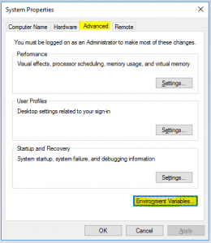

Whilst Sysinternals can be downloaded and ran from the location to which they are extracted to, there is more preferable way to install on a system in which they will be used more frequently.

 	* Download Sysinternals from: [https://docs.microsoft.com/en-us/sysinternals/](https://docs.microsoft.com/en-us/sysinternals/)

 	Extract the downloaded zip contents to: C:\Program Files (x86)\SYSINT

 	* Extracting to this directory is useful for white-listing

 	Run the program "sysdm.cpl" from the Windows menu

 	Click the "Advanced Tab" -> Click "Environment Variables"

 	Double click on the "Path" variable -> Add a new variable pointing to: C:\Program Files (x86)\SYSINT

 	* Now we can run the Sysinternal tools from cmd without needing to be in the directory

 	Add a new System variable named "_NT_SYMBOL_PATH" with the value "srv*c:\symbols*http://msdl.microsoft.com/download/symbols"

**Tip:** Use the flag "/accepteula" to prevent the interactive window appearing when using the tools in a batch, for example.
