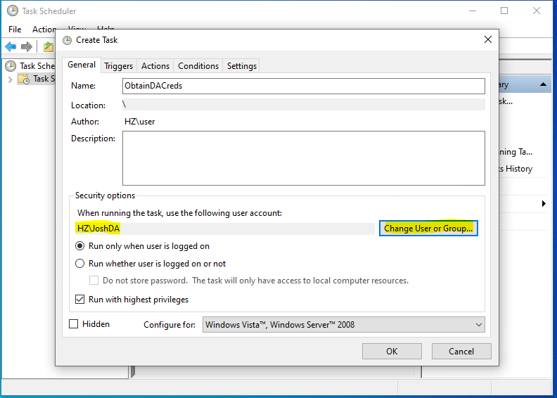
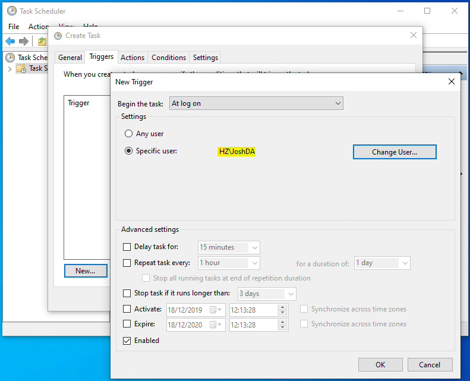
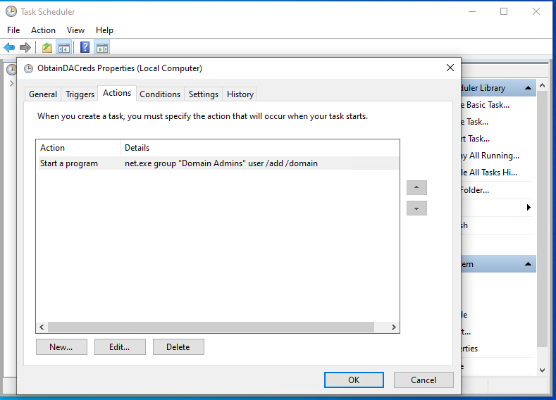
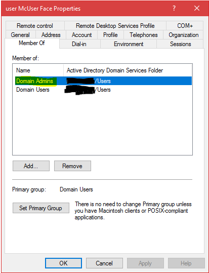

This method may benefit from some social engineering but will require local Administrator on an machine within the network. Social engineering can be used to speedup the process of enticing a Domain Admin (DA) to login to a system and in-return provide us DA rights.

Should you need to obtain local Administrator privileges and you have access to a machine which isn't using Bit-locker, [here is a guide on doing so](https://blog.joshuarobbins.tech/gaining-entry-into-windows-with-administrative-permissions) (It wont take long).

- Create a new scheduled task
- Ensure the "Run with highest privileges" checkbox is checked

 	Change the user in which the task will run as to that of the target DA account

 	Set the trigger to be when the target DA logs onto the machine

Set the action to run 'net.exe' -> add the parameter 'group "Domain Admins" user /add /domain'

Now we lay in wait. Perhaps you have Admins which use their DA accounts for remote support, you could always raise a ticket and get them to remote onto the machine. You could also set this trap on a machine which you know the DAs will login to (Provided you have local Admin).

This method can be mitigated through blocking Domain Admins from logging into workstations by group policy and following the principle of least privilege.
