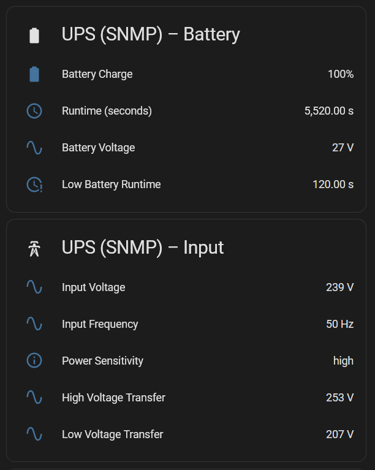
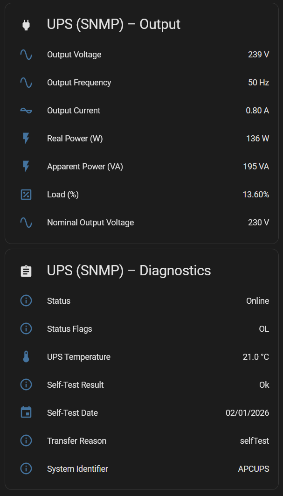

# Introduction

I run an APC Smart‑UPS 1500 with an AP9630 Network Management Card (NMC) in my homelab. A Raspberry Pi handles Network UPS Tools (NUT), which lets me gracefully shut down power‑sensitive systems like my NAS.

USB monitoring with NUT worked fine, but SNMP was a different story. The NMC was exposing newer OIDs that the packaged version of NUT simply didn’t understand. The fix was to build a newer version of NUT from source - and that’s what this guide walks through.

## Why SNMP?

USB monitoring works well enough for basic shutdown automation. But once I started integrating Home Assistant dashboards and automations, the USB HID driver felt extremely limited. SNMP exposes far richer telemetry: load, battery capacity, runtime estimates, temperature, alarms, and more.


## The problem: outdated NUT packages

A simple:

```
sudo apt-get update && sudo apt-get upgrade
```

…won’t help. Debian‑based distros typically ship NUT **2.7.x**, while upstream is already at **2.8+**. The SNMP driver improvements you need are only in the newer releases.

You can grab the latest tarball from:  
https://networkupstools.org/download.html

---

## Configuring SNMPv3 on the APC AP9630

On the AP9630 NMC, enable and configure SNMPv3:

**Configuration → Network → SNMPv3 → Access**  
Enable SNMPv3.

**Configuration → Network → SNMPv3 → User Profiles**  
Create a user with:

- Security Level: `authPriv`
- Authentication Protocol: `SHA`
- Privacy Protocol: `AES`
- Authentication Passphrase: *your choice*
- Privacy Passphrase: *your choice*


> [!TIP] 
> Test your SNMPv3 credentials with:
> ```
> snmpwalk -v3 -u "nutuser" -l authPriv \
>   -a SHA -A "<Auth Passphrase>" \
>   -x AES -X "<Priv Passphrase>" \
>   <NMC IP> 1.3.6.1.2.1.3
> ```

---

## Installing a newer version of NUT

### 1. Back up your existing configuration

```
sudo cp -a /etc/nut ~/nut-backup-$(date +%Y%m%d-%H%M)/
```

### 2. Remove the distro‑packaged NUT

```
sudo apt remove nut nut-server nut-client
```

A reboot here avoids leftover processes interfering.

### 3. Download and extract the latest NUT release

```
wget https://www.networkupstools.org/source/2.8/nut-2.8.4.tar.gz
tar xzf nut-2.8.4.tar.gz
cd nut-2.8.4
```

### 4. Configure the build

Install packages required to build

```
sudo apt install build-essential libusb-1.0-0-dev libsnmp-dev libssl-dev libtool automake autoconf pkg-config libgd-dev
```

Replace `nut` with the user/group you want NUT to run under.

```
./configure \
  --with-usb \
  --with-snmp \
  --with-systemd \
  --with-serial \
  --with-openssl \
  --prefix=/usr \
  --sysconfdir=/etc/nut \
  --with-user=nut \
  --with-group=nut
```

### 5. Build and install

```
make
sudo make install
sudo make install-as-root
```

### 6. Restore or recreate your configuration

Copy your backed‑up files or create fresh ones (examples below).

### 7. Restart NUT

```
sudo systemctl restart nut
```

### 8. Verify the driver is running

```
systemctl status nut-driver@ups.service
```

(Substitute `ups` with your driver name.)

---

## Fixing USB HID permission issues (if using USB + SNMP)

If the USB driver fails to claim the device:

### 1. Check for udev rules

```
ls -l /etc/udev/rules.d/ | grep nut
```

### 2. Identify your UPS

```
lsusb
```

Example:

```
Bus 001 Device 003: ID 051d:0003 American Power Conversion UPS
```

### 3. Check permissions

```
ls -l /dev/bus/usb/001/003
```

You should see group ownership matching your NUT user.

### 4. If needed, copy the default rules

```
sudo cp /lib/udev/rules.d/62-nut-usbups.rules /etc/udev/rules.d/
sudo udevadm control --reload-rules
sudo udevadm trigger
```

> [!TIP] 
> Check running drivers:
> ```
> ps aux | grep -E "snmp-ups|usbhid-ups"
> ```

If something still isn’t working, inspect logs:

```
sudo journalctl -u nut-driver@apc_snmp.service -n 50
sudo journalctl -u nut-driver@ups.service -n 50
```

---

## My NUT Configuration

I run **both** USB and SNMP drivers.

### `/etc/nut/nut.conf`

```
MODE=netserver
```

### `/etc/nut/ups.conf`

```
maxretry = 3

[apc_snmp]
  driver = snmp-ups
  port = <NMC HOSTNAME/IP>
  desc = "APC Smart-UPS via SNMPv3"
  snmp_version = v3
  secLevel = authPriv
  secName = nutuser
  authProtocol = SHA
  authPassword = <Authentication Passphrase>
  privProtocol = AES
  privPassword = <Privacy Passphrase>

[ups]
  driver = usbhid-ups
  desc = "APC 1500"
  port = auto
  vendorid = 051D
  productid = 0003
```

> [!TIP] 
> The section names (`[apc_snmp]`, `[ups]`) are what you pass to `upsc`:
> ```
> upsc apc_snmp@localhost
> ```

### `/etc/nut/upsd.users`

```
[upsmon]
  password = <PASSWORD>
  upsmon primary
  actions = SET
  instcmds = ALL

[observer]
  password = <PASSWORD>
  upsmon secondary
```

---

## Final checks

Reboot your NUT host and confirm:

- SNMP driver starts cleanly  
- USB driver (if used) claims the device  
- `upsc <name>@localhost` returns data  
- Home Assistant or other consumers can poll NUT  

Once everything is stable, you’ll have a far richer UPS monitoring setup than USB alone can offer.



